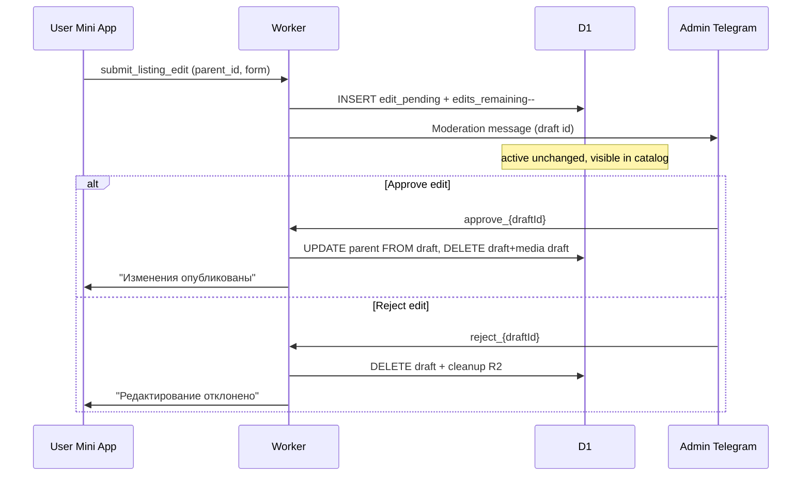

# ТЗ: Редактирование мини-резюме (3 раза) — Нетворкинг Нячанг
### Feature Spec для Cursor · Версия 1.5

> **Статус:** реализовано (v1.5, 01.06.2026). Деплой: `DEPLOY_GUIDE_CF.md` §D2e.  
> **Стек:** Cloudflare Worker + D1 + R2, фронт `catalog.html`.  
> **Связанные ТЗ:** `networking_nhatrang_tz.md`, `portfolio_TZ.md`, `pinned_listings_TZ.md`, `keywords_system_TZ.md`.

**Changelog 1.5:** аудит v1.4 — заголовок §6.1.1; SQL-поля в §5.3; слияние `p-actions` и `pinBtnHtml` для `on_moderation` (§6.3); оплата в тексте модерации edit (§5.7); UNIQUE → `edit_already_pending` (§8).  
**Changelog 1.4:** backfill для всех active зафиксирован; портфолио при edit — checkbox **выкл.** по умолчанию + hint (§6.2); кнопка «Редактировать» на `on_moderation` → popup «после публикации» (§6.1.1).  
**Changelog 1.3:** retry upload портфолио для `edit_pending` (`edit_draft_id` в API + кнопка в профиле); guard `edits_remaining` в UPDATE batch; тексты §7 для deferred notify edit; partial UNIQUE на один черновик; правки §6.2/QA.  
**Changelog 1.2:** исправлена ссылка §1.2; полный INSERT в §5.2; `env.DB.batch`; ветка portfolio на фронте (как `runFreeSubmit`, без преждевременного сброса `formEditMode`); popup и на `paidBtn`; CSS `.is-exhausted`; флаг `has_edit_pending` vs статус; data-атрибуты prefill; псевдокод approve без `getListingStatus`; QA #15.  
**Changelog 1.1:** аудит против кодовой базы — условный перенос портфолио при approve (не удалять фото родителя без медиа на черновике); интеграция `portfolio.ts` со статусом `edit_pending`; очистка `edit_pending` при авто-архивации cron; D1 batch при submit; `NULL` → 3 для `edits_remaining`; выравнивание CSS-класса кнопки; правки §6.3 и промптов.

---

## 0. Контекст

Сейчас активную анкету можно только **архивировать** и разместить новую (republish из архива/rejected). Нужно **редактировать текст/поля** без смены сроков размещения и без потери `listing_id` в каталоге (лайки, избранное, закрепление).

**Ключевая идея:** при редактировании в БД создаётся **вторая запись** `listings` (черновик), в каталоге и в «Мой профиль» пользователь по-прежнему видит **старую активную** карточку. После одобрения модератором данные черновика **переносятся** в активную запись, черновик **удаляется**.

---

## 1. Рекомендации и открытые вопросы (для заказчика)

| # | Тема | Рекомендация / вопрос |
|---|------|------------------------|
| 1 | **«С момента заполнения»** | В ТЗ зафиксировано: **3 редактирования выдаются при первом одобрении** анкеты (`status → active`), а не при первой отправке формы. Иначе пользователь мог бы «потратить» правки до появления карточки в каталоге. Если нужен отсчёт с `submit_listing` — изменить §3.1. |
| 2 | **Отклонение первого размещения** | **Не списывает** право редактирования (редактирование доступно только для `active`). Фраза в popup про отклонение модератором относится к **отклонённому редактированию** (см. §2 п.4 и §7). |
| 3 | **Портфолио при редактировании** | **v1:** та же форма; checkbox портфолио **выключен** при открытии edit (даже если у active есть фото) — см. §6.2. Замена фото только при явной галочке + upload на черновик. При approve — перенос медиа **только если** на черновике есть строки в `listing_media` (§4.2). |
| 4 | **Один черновик** | Одновременно не более **одного** `edit_pending` на пользователя. Повторное «Редактировать» при уже отправленном черновике → ошибка + подсказка «ожидайте модерации». |
| 5 | **Смена категории** | Разрешена; после одобрения карточка исчезнет из старой категории и появится в новой. Лайки/избранное остаются на том же `listing_id`. |
| 6 | **Архив во время модерации правки** | При `archive_listing` активной — **удалить** связанный `edit_pending` (и медиа), уведомление не обязательно. То же при **авто-архивации** по cron (§5.8). |
| 7 | **Показ popup при размещении** | Показывать **каждый раз** при переходе к отправке новой анкеты (бесплатно / платно), **не** показывать в режиме `edit`. Опционально: `sessionStorage` «не показывать снова» — только если заказчик попросит. |
| 8 | **Подсказка в профиле** | Пока есть `edit_pending`, на активной карточке — нейтральная строка «Изменения на проверке модератором» **без** текста новой анкеты (см. §6.3). |
| 9 | **Backfill `edits_remaining = 3`** | ✅ **Зафиксировано:** всем текущим **active** при миграции — **3** правки (как новым после approve). SQL в §3.1. |

---

## 2. Бизнес-правила (зафиксировано)

1. Редактировать можно только анкету со статусом **`active`**.
2. Лимит: **3 редактирования** на один цикл жизни активной публикации (см. §3.1).
3. Счётчик **уменьшается при успешной отправке** `submit_listing_edit` (черновик создан), **не** при одобрении модератором.
4. **Отклонение** редактирования модератором: пользователю сообщение в Telegram; черновик **удаляется** из БД; **`edits_remaining` не возвращается** (правка была использована).
5. **Одобрение:** содержимое черновика → в активную запись с **тем же `listing_id`**; `created_at`, `expires_at`, `submitted_at` (исходные), `pin_*`, `payment_status` — **без изменений**; черновик и его «буфер» удаляются.
6. Старая карточка **остаётся в поиске** до одобрения правки.
7. Пользователь **не видит** текст новой версии в «Мой профиль» до одобрения.
8. Редактирование **не продлевает** и **не сбрасывает** сроки размещения и закрепления.
9. Popup при **«Отправить на модерацию»** / **«Разместить платно»** (новое размещение): информировать о правиле 3 правок **после публикации**, в т.ч. что **отклонённое редактирование** всё равно расходует одну попытку. Кнопка **«Понятно»** → продолжить текущее действие (как `linkPopupOk`).
10. Кнопка в профиле: **`Редактировать`** (стиль `.pin-btn` / CTA) + meta (стиль `.like-label`). **`active`:** meta «осталось: N»; при `N = 0` или `has_edit_pending` — disabled + `.is-exhausted`. **`on_moderation`:** кнопка **активна** (не disabled), meta «после публикации»; клик → popup §6.1.1 (редактирование недоступно до одобрения).
11. Форма редактирования — **та же**, что при размещении (`goToFormEdit` + prefill с активной анкеты).
12. Платное/бесплатное размещение, `free_used`, блокировка `findBlockingListing` для **новой** анкеты — **без изменений**; `edit_pending` **не** участвует в блокировке.

---

## 3. Схема данных (D1)

### 3.1. Миграция `010_listing_edit.sql`

```sql
-- На активной анкете — остаток правок (NULL = не применимо / ещё не выдано)
ALTER TABLE listings ADD COLUMN edits_remaining INTEGER;

-- Черновик редактирования ссылается на активную анкету
ALTER TABLE listings ADD COLUMN replaces_listing_id TEXT;

CREATE INDEX IF NOT EXISTS idx_listings_edit_pending
  ON listings(tg_id, status)
  WHERE status = 'edit_pending';

CREATE INDEX IF NOT EXISTS idx_listings_replaces
  ON listings(replaces_listing_id)
  WHERE replaces_listing_id IS NOT NULL;

-- Не более одного edit_pending на пользователя (защита от race, дополнение к проверке в handler)
CREATE UNIQUE INDEX IF NOT EXISTS idx_listings_one_edit_pending_per_user
  ON listings(tg_id)
  WHERE status = 'edit_pending';
```

**Инициализация существующих строк:**

- `edits_remaining = NULL` для `archived` / `rejected` / `on_moderation` / `edit_pending`.
- При следующем `approve` обычной анкеты: `edits_remaining = 3` (если `IS NULL`).
- **Backfill (обязательно):** всем текущим **active** — полный лимит, как новым после approve:
  `UPDATE listings SET edits_remaining = 3 WHERE status = 'active' AND edits_remaining IS NULL;`

### 3.2. Статусы `listings.status`

| Статус | Каталог | Мой профиль | Поиск |
|--------|---------|-------------|-------|
| `active` | да | да | да |
| `edit_pending` | **нет** | **нет** (только hint на родителе) | **нет** |
| `on_moderation` | нет | да | нет |
| остальные | как сейчас | как сейчас | нет |

### 3.3. Поля

| Поле | Где | Описание |
|------|-----|----------|
| `edits_remaining` | родитель `active` | `3…0`, `NULL` если не применимо |
| `replaces_listing_id` | черновик `edit_pending` | `listing_id` активной анкеты |

**Инварианты:**

- `edit_pending` ⇒ `replaces_listing_id IS NOT NULL`, родитель `status = 'active'` (на момент submit).
- Родитель `active`: после backfill `edits_remaining` в `0…3`; до первого approve новой анкеты — `NULL`.
- Уникальность: не более одного `edit_pending` на `tg_id` (проверка в handler).

### 3.4. Обновить `worker/src/db/schema.sql`

Добавить колонки и комментарий к статусу `edit_pending` в документации схемы.

---

## 4. Архитектура

### 4.1. Поток редактирования



### 4.2. Слияние при одобрении (`approveListingEdit`)

1. Загрузить `draft` (`edit_pending`) и `parent` по `draft.replaces_listing_id`.
2. Проверить: `parent.status = 'active'`, `parent.tg_id = draft.tg_id`. Иначе — `answerCallbackQuery` админу («Родительская анкета недоступна»), без изменений в БД.
3. **UPDATE parent** полями: `display_name`, `category`, `description`, `experience`, `contact_type`, `contacts`, `avatar_emoji`, `keywords` — **не трогать** `created_at`, `expires_at`, `submitted_at`, `pin_*`, `payment_status`, `status`, `listing_id`, `edits_remaining`.
4. **Портфолио** (ветвление обязательно):

   ```text
   draftHasMedia = EXISTS (SELECT 1 FROM listing_media WHERE listing_id = draft.listing_id)
   -- любой status (pending/active); пустой черновик → ветка ELSE

   IF draftHasMedia:
     - deleteMediaByListing(parent)  // R2 + listing_media
     - UPDATE listing_media SET listing_id = parent.listing_id WHERE listing_id = draft.listing_id
     - UPDATE listing_media SET status = 'active' WHERE listing_id = parent.listing_id AND status = 'pending'
   ELSE:
     - медиа родителя не изменять
   ```

   Без этой ветки правка **только текста** (без `portfolio_enabled` / без upload) **сотрёт** фото в каталоге.

5. **DELETE** строку `draft` из `listings` (CASCADE остатков медиа черновика, если есть).
6. `purgeFavoritesForListing` — **не вызывать** (`listing_id` родителя тот же).
7. **Не вызывать** `setUserFreeUsed` (это не первое размещение).
8. Уведомление пользователю, лог `approve_edit`.

### 4.3. Отклонение черновика

`rejectListingEdit(draftId)`:

1. Проверить `status = 'edit_pending'`.
2. `cleanupPortfolioOnReject(draftId, tgId, env)` — как для rejected.
3. `DELETE FROM listings WHERE listing_id = ?`.
4. Сообщение пользователю (§7).
5. **`edits_remaining` родителя не менять** (уже уменьшено при submit).
6. Лог `reject_edit`.

### 4.4. `findBlockingListing`

Расширять **не нужно**: `edit_pending` вне `IN ('on_moderation','active')`.

Отдельная проверка в `submit_listing_edit`: нет ли уже `edit_pending` у `tg_id`.

### 4.5. Портфолио и `edit_pending`

Сейчас `upload_portfolio` / retry принимают только `status = 'on_moderation'` (`portfolio.ts`). Для редактирования:

| Место | Изменение |
|-------|-----------|
| `listingUploadError` / `handleUploadPortfolio` / retry-handler | разрешить `status IN ('on_moderation', 'edit_pending')` |
| `shouldSendDeferredNotify` + `sendDeferredFreeNotify` | для `edit_pending` — admin: §5.7 (`buildEditModerationAdminText`); user: §7 «Submit edit», не «первое бесплатное» |
| `handleSubmitListingEdit` | при `portfolio_enabled: true` — `deferred_notify: true` (как `submit_listing`), без мгновенного notify |
| Окно retry | те же **24 ч** от `submitted_at` черновика |

Платный flow / `promoteStaging` для edit **не используется** (`#paidBtn` скрыт).

**Prefill портфолио (edit, v1):**

- При `goToFormEdit` — **не** включать `#portfolio_enabled`, **не** копировать фото родителя в слоты.
- Под блоком портфолио — hint `.portfolio-edit-hint` (только `formEditMode`): «Чтобы заменить фото, отметьте галочку и загрузите новые. Если не загружать — текущие фото в каталоге сохранятся.»
- `portfolio_enabled` в payload edit — только если `shouldUploadPortfolio()` (галочка **и** файлы), как при новом размещении.
- Согласовано с §4.2: без медиа на черновике родительские фото не трогаются.

---

## 5. Backend (Worker)

### 5.1. Новые / изменённые actions

| action | Handler | Auth |
|--------|---------|------|
| `submit_listing_edit` | `handleSubmitListingEdit` | `validateMiniAppRequest` |
| `get_edit_quota` | опционально | можно вложить в `get_my_listings` |

Регистрация в `worker/src/handlers/api.ts`.

### 5.2. `handleSubmitListingEdit`

**Тело:** как `submit_listing` + `parent_listing_id` (в БД черновика колонка `replaces_listing_id = parent_listing_id`).

**Алгоритм:**

```
1. validateMiniAppRequest, rejectIfBanned
2. validateListingForm(body)
3. parent = SELECT * FROM listings WHERE listing_id = ? AND tg_id = ? AND status = 'active'
4. IF NOT parent → error listing_not_active
5. quota = COALESCE(parent.edits_remaining, 3)   // legacy NULL после backfill не должно быть, но защита
   IF quota < 1 → error no_edits_remaining
6. IF EXISTS (SELECT 1 FROM listings WHERE tg_id = ? AND status = 'edit_pending') → error edit_already_pending
7. draftId = generateId(tgId); now = ISO
8. env.DB.batch([...]) — атомарно, по образцу D1 batch в Worker:
   a. INSERT INTO listings (
        listing_id, tg_id, display_name, category, description, experience,
        contact_type, contacts, status, payment_status, created_at, expires_at,
        submitted_at, avatar_emoji, pin_status, keywords, replaces_listing_id, edits_remaining
      ) VALUES (
        draftId, tgId, <form fields>,
        'edit_pending', parent.payment_status, NULL, NULL, now,
        <avatar_emoji>, 'regular', serialize(keywords),
        parent.listing_id, NULL
      )
   b. UPDATE listings SET edits_remaining = COALESCE(edits_remaining, 3) - 1
      WHERE listing_id = parent.listing_id
        AND COALESCE(edits_remaining, 3) >= 1
      -- если meta.changes === 0 → откат batch / error no_edits_remaining
9. portfolio_enabled === true → { ok, listing_id: draftId, deferred_notify: true } (без admin notify)
   иначе → admin notify §5.7 + user message §7
10. logAction submit_listing_edit
```

**Не вызывать:** `setUserFreeUsed`, не менять `created_at`/`expires_at` родителя.

### 5.3. `handleGetMyListings`

- `WHERE l.tg_id = ? AND l.status != 'edit_pending'`.
- В SELECT для строки `active` (или в `mapMyListing` только при `status = 'active'`):

```sql
COALESCE(l.edits_remaining, 3) AS edits_remaining,
EXISTS (
  SELECT 1 FROM listings d
  WHERE d.replaces_listing_id = l.listing_id AND d.status = 'edit_pending'
) AS has_edit_pending,
(SELECT d.listing_id FROM listings d
 WHERE d.replaces_listing_id = l.listing_id AND d.status = 'edit_pending'
 LIMIT 1) AS edit_draft_id,
CASE WHEN EXISTS (
  SELECT 1 FROM listings d
  WHERE d.replaces_listing_id = l.listing_id AND d.status = 'edit_pending'
) AND NOT EXISTS (
  SELECT 1 FROM listing_media lm
  INNER JOIN listings d ON d.listing_id = lm.listing_id
  WHERE d.replaces_listing_id = l.listing_id AND d.status = 'edit_pending'
) THEN 1 ELSE 0 END AS edit_draft_needs_portfolio
```

- `has_edit_pending` — имя поля **не** `edit_pending`, чтобы не путать со статусом строки.
- `edit_draft_needs_portfolio` — `true`, если есть черновик и у него **нет** строк в `listing_media` (кнопка «Отправить фото», аналог `on_moderation && !has_portfolio`).

### 5.4. `handleGetListings`

Без изменений (`status = 'active'`).

### 5.5. `approveListing` / `rejectListing` в `telegram.ts`

В начале `approveListing` / `rejectListing`:

```typescript
const row = await env.DB.prepare('SELECT status FROM listings WHERE listing_id = ?')
  .bind(listingId).first<{ status: string }>();
if (row?.status === 'edit_pending') {
  return approveListingEdit(...) / rejectListingEdit(...);
}
// существующая логика on_moderation → active / rejected
```

**При первом approve обычной анкеты** (не edit):

```sql
UPDATE listings SET status = 'active', created_at = ?, expires_at = ?,
  edits_remaining = COALESCE(edits_remaining, 3)
WHERE listing_id = ?
```

### 5.6. `archive_listing` и авто-архив

**Ручной архив** — после `UPDATE` родителя в `archived`:

```sql
SELECT listing_id FROM listings
 WHERE status = 'edit_pending' AND replaces_listing_id = ?
```

Для каждого: `cleanupPortfolioOnReject(draftId, tgId, env)` + `DELETE FROM listings WHERE listing_id = ?`.

**Вынести** в `cleanupEditPendingForParent(parentListingId, tgId, env)` и вызывать также из `dailyMaintenance`, когда активная анкета переводится в `archived` по истечению срока (§5.8).

### 5.7. Тексты модерации

**Admin (редактирование):**

```
✏️ РЕДАКТИРОВАНИЕ АНКЕТЫ
draft_id: …
parent_id (в каталоге): …
Пользователь ID: …
Оплата: <как у draft.payment_status — free / paid, не «первое бесплатное»>
… поля как в обычной модерации …
⚠️ До одобрения в каталоге показывается старая версия (parent_id).
```

Клавиатура — те же `approve_` / `reject_` (callback по **draft** `listing_id`).

### 5.8. Cron / maintenance

`dailyMaintenance`:

1. Существующая логика (архив active, pin expiry, purge archived).
2. **Новое:** `edit_pending` с `submitted_at` старше **7 суток** (настраиваемо), отдельным запросом до/после цикла active:

   ```sql
   SELECT listing_id, tg_id FROM listings
   WHERE status = 'edit_pending'
     AND submitted_at < datetime('now', '-7 days')
   ```

   Для каждой строки: `cleanupPortfolioOnReject` → `DELETE` черновик → уведомление §7 → **`edits_remaining` не возвращать** (как reject). Залогировать `stale_edit_cleanup`.
3. При авто-архивации **active** — `cleanupEditPendingForParent` (§5.6).

---

## 6. Frontend (`catalog.html`)

### 6.1. Popup «Право редактирования» (`#editsInfoPopup`)

Стиль: `.popup-overlay` + `.popup` (как `#linkPopup` / `#keywordsAboutPopup`).

**HTML (эскиз):**

```html
<div id="editsInfoPopup" class="popup-overlay" hidden>
  <div class="popup" role="dialog">
    <div class="popup-icon">✏️</div>
    <h3 class="popup-title">Редактирование после публикации</h3>
    <p class="popup-text">
      После размещения мини-резюме в каталоге вы сможете изменить текст
      <strong>до 3 раз</strong> (кнопка в «Мой профиль»).
      Пока правки проверяются, в каталоге остаётся прежняя версия.
      Если модератор <strong>отклонит редактирование</strong>, попытка всё равно будет засчитана.
    </p>
    <button type="button" id="editsInfoOk" class="btn btn-primary">Понятно</button>
  </div>
</div>
```

**Поведение:**

- `showEditsInfoPopup(onContinue)` — по «Понятно» вызывает `onContinue()` (отправка free / переход на payment).
- Вызов **перед** `runFreeSubmit` (обёртка вокруг существующего submit free) и **перед** переходом `paidBtn` → `showScreen('payment')`, только если `!formEditMode`.
- Режим редактирования: `formEditMode === true` → popup **не показывать**.
- Платный flow edit **не используется** — popup для edit не нужен; для **нового** paid по-прежнему показывать перед экраном оплаты.

### 6.1.1. Popup «Редактирование пока недоступно» (`#editsWaitModerationPopup`)

Отдельный popup для анкет **`on_moderation`** (не путать с `#editsInfoPopup` при новом размещении).

**HTML (эскиз):**

```html
<div id="editsWaitModerationPopup" class="popup-overlay" hidden>
  <div class="popup" role="dialog">
    <div class="popup-icon">⏳</div>
    <h3 class="popup-title">Редактирование пока недоступно</h3>
    <p class="popup-text">
      Эта анкета ещё на проверке модератором и не опубликована в каталоге.
      Редактировать можно только <strong>активное</strong> мини-резюме — после одобрения
      в «Мой профиль» появится кнопка «Редактировать» (до 3 раз).
    </p>
    <button type="button" id="editsWaitModerationOk" class="btn btn-primary">Понятно</button>
  </div>
</div>
```

**Поведение:**

- `showEditsWaitModerationPopup()` — по «Понятно» закрыть (без callback).
- Кнопка на карточке `on_moderation`: `data-action="edit-wait"` → этот popup.
- Backend для `on_moderation` **не вызывается** (форма edit не открывается).

### 6.2. Режим формы `formEditMode`

```javascript
var formEditMode = false;
var formEditParentId = null;
```

`goToFormEdit(prefill)` (обёртка над `goToForm(prefill)`):

- `formEditMode = true`, `formEditParentId = prefill.listing_id` (id родителя)
- prefill: те же поля, что у `data-action="republish"` (§6.4)
- `updateSubmitBtnLabel`: текст **«Отправить правки на модерацию»** (или **«Отправить фото»** при `_pendingPortfolioListingId`, как сейчас)
- Скрыть `#paidBtn`, не показывать paid banner для edit
- `_formReturnScreen = 'profile'`
- Портфолио: `#portfolio_enabled` **сброшен** (unchecked); hint `.portfolio-edit-hint` visible (§4.5). Upload на **draft** `listing_id` только при явной галочке + файлах. Без upload — фото родителя в каталоге сохраняются (§4.2).
- При выходе из edit (`formEditMode = false`) — скрыть hint.

Submit — отдельная функция `runEditSubmit` (ветка в `form.addEventListener('submit')` при `formEditMode`):

- `action: 'submit_listing_edit'`, `parent_listing_id: formEditParentId`, поля формы как у `submit_listing`
- **Без portfolio:** как `runFreeSubmit` без portfolio → сообщение → `resetFormAfterSuccess()` → `formEditMode = false` → `showScreen('profile')` → `loadProfile()`
- **С portfolio:** как `runFreeSubmit` с portfolio — `_pendingPortfolioListingId = draftId`, остаться на форме, **не** сбрасывать `formEditMode` до успешного upload / retry; затем profile + сброс режима
- Ошибка `edit_already_pending` / `no_edits_remaining` на submit — показать ERRORS **на форме** (не редиректить)

### 6.3. Кнопка на карточке профиля

**CSS:** `.edit-btn` extends `.pin-btn`; meta `.edit-btn-meta` — стиль `.like-label`. Disabled: `.edit-btn.is-exhausted` — **те же визуальные правила**, что у `.pin-btn.is-pinned-state` (сейчас в `catalog.html` нет класса `is-exhausted`, добавить в фазе 4).

**Разметка:** кнопка «Редактировать» — в блоке `pinBtnHtml` для **`active`** и **`on_moderation`** (сейчас `pinBtnHtml` строится только при `isActive` — расширить ветку); «В архив» и «Отправить фото» (edit) — в `actions` только для `active`.

**Сборка `actions`:** не перезаписывать переменную целиком (как сейчас для `republish`/`archive`); **дополнять** блоки: при `has_edit_pending && edit_draft_needs_portfolio` добавить кнопку `upload-edit-portfolio` к уже собранному `archive`.

```html
<!-- active -->
<button class="edit-btn pin-btn" data-action="edit" data-id="…" data-remaining="2"
  data-name="…" data-cat="…" …>
  <span class="edit-btn-title">Редактировать</span>
  <span class="edit-btn-meta like-label">осталось: 2</span>
</button>

<!-- on_moderation -->
<button class="edit-btn pin-btn" data-action="edit-wait">
  <span class="edit-btn-title">Редактировать</span>
  <span class="edit-btn-meta like-label">после публикации</span>
</button>

<div class="p-edit-hint" hidden>✏️ Изменения на проверке модератором</div>
<!-- active + has_edit_pending && edit_draft_needs_portfolio — в actions: -->
<button class="btn btn-primary" data-action="upload-edit-portfolio"
  data-draft-id="…">Отправить фото</button>
```

**Состояния `active` (в `loadProfile`):**

| Условие | Кнопка «Редактировать» | Hint | Доп. |
|---------|------------------------|------|------|
| `has_edit_pending` | `disabled` + `is-exhausted`, meta «На модерации» | показать | если `edit_draft_needs_portfolio` — «Отправить фото» → `goToFormEditPortfolioRetry(draftId)` |
| `remaining < 1` | `disabled` + `is-exhausted`, meta «осталось: 0» | скрыть | — |
| иначе | активна, meta `осталось: N` | скрыть | — |

**`on_moderation`:** кнопка `data-action="edit-wait"`, **не** disabled; клик → §6.1.1. Meta: «после публикации».

`remaining` = `l.edits_remaining` из API (только `active`). Клик по disabled `active` — не открывать форму.

`goToFormEditPortfolioRetry(draftId)` — как `goToFormPortfolioRetry`, но `formEditMode = true`, `formEditParentId` из `replaces_listing_id` (или передать с API), `_formReturnScreen = 'profile'`, submit → upload на `draftId` (статус `edit_pending`).

### 6.4. Обработчики клика

```javascript
document.querySelectorAll('[data-action="edit-wait"]').forEach(function (btn) {
  btn.addEventListener('click', function () {
    showEditsWaitModerationPopup();
  });
});

document.querySelectorAll('[data-action="edit"]').forEach(function (btn) {
  btn.addEventListener('click', function () {
    if (btn.disabled) return;
    goToFormEdit({
      listing_id: btn.getAttribute('data-id'),
      display_name: btn.getAttribute('data-name'),
      category: btn.getAttribute('data-cat'),
      avatar_emoji: btn.getAttribute('data-avatar'),
      experience: btn.getAttribute('data-exp'),
      description: normalizeDescription(btn.getAttribute('data-desc')),
      contact_type: btn.getAttribute('data-contact-type'),
      contacts: btn.getAttribute('data-contacts'),
      keywords_enabled: btn.getAttribute('data-keywords-enabled') === 'true',
      keywords: parseKeywordsAttr(btn.getAttribute('data-keywords'))
    });
  });
});
```

### 6.5. ERRORS (клиент)

| key | Текст |
|-----|-------|
| `no_edits_remaining` | Лимит редактирований исчерпан |
| `edit_already_pending` | Дождитесь проверки предыдущих изменений |
| `listing_not_active` | Редактировать можно только активную анкету |

---

## 7. Сообщения пользователю (Telegram)

| Событие | Текст (черновик) |
|---------|------------------|
| Submit edit | «Изменения отправлены на модерацию. В каталоге пока отображается прежняя версия анкеты.» |
| Approve edit | «✅ Изменения одобрены и опубликованы в каталоге. Срок размещения не изменился.» |
| Reject edit | «❌ Редактирование отклонено. В каталоге по-прежнему прежняя версия. Попытка редактирования использована. Осталось правок: {N}. …» (`N` = `edits_remaining` родителя) |
| Stale edit (cron) | «Срок ожидания правок истёк. Отправьте редактирование снова, если остались попытки.» |

---

## 8. Безопасность и краевые случаи

- `parent_listing_id` только для `tg_id` из `initData`.
- Admin approve/reject — существующие callback.
- Race: два submit → второй `edit_already_pending`; decrement только в **batch** с INSERT (§5.2). Нарушение UNIQUE `idx_listings_one_edit_pending_per_user` — тот же код ошибки `edit_already_pending`.
- Republish → новая активная после approve: `edits_remaining = 3`.
- Лайки/избранное/pin: `listing_id` родителя не меняется.
- Approve edit при `parent` уже `archived` — отказ админу, черновик можно удалить вручную reject или cron.

---

## 9. План реализации (фазы)

| Фаза | Содержание | Файлы |
|------|------------|-------|
| **1** | Миграция D1, schema, backfill | `migrations/010_listing_edit.sql`, `schema.sql` |
| **2** | `submit_listing_edit`, quota в `get_my_listings`, archive + maintenance cleanup | `listings.ts`, `api.ts`, `maintenance.ts` |
| **3** | `approveListingEdit` / `rejectListingEdit`, ветвление, portfolio `edit_pending`, тексты | `telegram.ts`, `portfolio.ts` |
| **4** | Popup, кнопка профиля, `formEditMode` | `catalog.html` |
| **5** | QA, деплой, `DEPLOY_GUIDE_CF.md` | docs |

**Порядок деплоя:** миграция → Worker → `catalog.html`.

---

## 10. QA-чеклист

| # | Сценарий | Ожидание |
|---|----------|----------|
| 1 | Active, 3 правки, submit edit | `edits_remaining=2`, в каталоге старая версия |
| 2 | Approve edit | Каталог обновлён, тот же `listing_id`, сроки те же |
| 3 | Reject edit | Черновик удалён, счётчик не восстановлен |
| 4 | 3 reject подряд | Кнопка disabled, осталось: 0 |
| 5 | Popup при новом размещении | Показ, «Понятно» → submit/payment |
| 6 | Popup в режиме edit | Не показывается |
| 7 | `get_my_listings` | Нет черновика в списке; на родителе `has_edit_pending`, `edit_draft_id` |
| 8 | `get_listings` | Только старая версия до approve |
| 9 | Edit **без** portfolio | После approve фото родителя **на месте** |
| 10 | Edit **с** portfolio | После approve фото с черновика, старые удалены |
| 11 | Archive / cron archive при pending edit | Черновик удалён |
| 12 | Pin + approve edit | Pin сохранён |
| 13 | Likes | Счётчик на том же id |
| 14 | Stale edit_pending 7+ дней | Удалён, попытка не возвращена |
| 15 | Edit + portfolio, deferred | После submit — форма/upload; после upload — profile, hint «На модерации» |
| 16 | Edit + portfolio, upload прерван | В профиле «Отправить фото» → retry на `edit_draft_id`, квота не списывается повторно |
| 17 | `on_moderation`, клик «Редактировать» | Popup §6.1.1, форма **не** открывается |
| 18 | Edit, родитель с portfolio | Checkbox выкл., hint виден; submit без галочки → фото родителя на месте после approve |

---

## 11. Промпты для ИИ (по фазам)

> **Всего промптов: 5** (фазы 1–5).  
> Выполнять **строго по порядку 1 → 5**.  
> Контекст: `@listing_edit_TZ.md`, `@worker/src/handlers/listings.ts`, `@worker/src/handlers/telegram.ts`, `@worker/src/handlers/portfolio.ts`, `@catalog.html`.  
> **Не ломать:** лайки, избранное, пины, keywords, оплату новых размещений.

### Промпт 1 — D1 и схема

```
По listing_edit_TZ.md §3:
1. worker/src/db/migrations/010_listing_edit.sql
2. Обнови schema.sql
3. Backfill active → edits_remaining = 3 где NULL
Handlers не трогать.
```

### Промпт 2 — API submit + listings + maintenance

```
По §5.2–5.3, §5.6, §5.8:
1. handleSubmitListingEdit (batch INSERT + decrement, deferred_notify)
2. api.ts — submit_listing_edit
3. get_my_listings — скрыть edit_pending; edits_remaining, has_edit_pending, edit_draft_id, edit_draft_needs_portfolio
4. cleanupEditPendingForParent + archive_listing + dailyMaintenance (архив active, stale edit_pending §5.8 SQL)
```

### Промпт 3 — Модерация + portfolio

```
По §4.2–4.5, §5.5, §5.7, §7:
1. approveListingEdit / rejectListingEdit (условный перенос portfolio §4.2)
2. Ветка edit_pending в approveListing/rejectListing
3. Обычный approve: edits_remaining = COALESCE(..., 3)
4. portfolio.ts: upload/retry/deferred notify для edit_pending + buildEditModerationAdminText
5. Тексты Telegram §7
```

### Промпт 4 — catalog.html

```
По §6: #editsInfoPopup (free + paidBtn), #editsWaitModerationPopup (on_moderation), edit-btn + .is-exhausted, goToFormEdit, goToFormEditPortfolioRetry, formEditMode, runEditSubmit, .portfolio-edit-hint, ERRORS.
Portfolio edit: checkbox выкл. по умолчанию; _pendingPortfolioListingId + upload как runFreeSubmit; upload-edit-portfolio из профиля.
Регрессия: republish, pin, portfolio retry для on_moderation.
```

### Промпт 5 — Документация и QA

```
DEPLOY_GUIDE_CF.md — миграция 010.
networking_nhatrang_tz.md — статус edit_pending + ссылка на listing_edit_TZ.md.
QA §10.
```

---

## 12. Связанные файлы

| Файл | Изменение |
|------|-----------|
| `worker/src/db/migrations/010_listing_edit.sql` | новый |
| `worker/src/db/schema.sql` | колонки, статус |
| `worker/src/handlers/listings.ts` | submit edit, get_my_listings, archive |
| `worker/src/handlers/api.ts` | route |
| `worker/src/handlers/telegram.ts` | approve/reject edit |
| `worker/src/handlers/portfolio.ts` | `edit_pending`, deferred notify edit |
| `worker/src/handlers/maintenance.ts` | stale + cleanup при архиве |
| `catalog.html` | popup, кнопка, form mode |
| `DEPLOY_GUIDE_CF.md` | миграция |
| `networking_nhatrang_tz.md` | ссылка |

---

## 13. Критерии приёмки

- [ ] Popup при новом размещении; «Понятно» продолжает flow.
- [ ] `active`: кнопка «Редактировать» + «осталось: N»; при N=0 или `has_edit_pending` — disabled (`is-exhausted`).
- [ ] `on_moderation`: кнопка «Редактировать» → popup «пока недоступно»; форма не открывается.
- [ ] Edit: portfolio checkbox выкл. по умолчанию; hint про сохранение текущих фото.
- [ ] До одобрения в каталоге старая версия; в профиле нет текста черновика.
- [ ] После одобрения — новые данные на том же `listing_id`, сроки и pin без изменений.
- [ ] Правка текста без portfolio — фото в каталоге сохранены.
- [ ] После отклонения — черновик удалён, счётчик не восстановлен.
- [ ] Не более 3 успешных submit edit на одну активную публикацию.

---

*Версия 1.5 · 01.06.2026*
