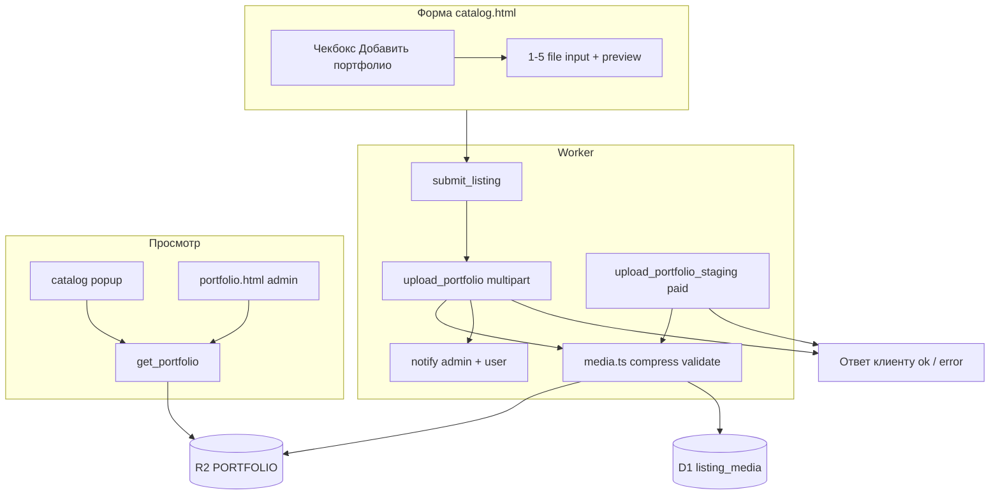

# Техническое задание: портфолио карточки (до 5 изображений, опционально)

**Версия:** 1.3  
**Дата:** 29.05.2026  
**Статус:** к реализации  
**Источник правды:** `portfolio_TZ.md` (этот файл), `worker/`, `catalog.html`, `rules.md` / `rules.html`

> **Changelog 1.3:** аудит v1.2 — **отложенный notify** при `portfolio_enabled` (free: админ + пользователь только после `upload_portfolio`); backfill `archived_at` через `expires_at`; upload/retry только `on_moderation`; staging строго перед `select_payment_method`; atomic upload; multipart в `index.ts`; правки `schema.sql`, `logAction`, промптов.  
> **Changelog 1.2:** ревизия по сверке с кодом — контракт `submit_listing` + `listing_id`, платный staging до `tg.close()`, `archived_at`/backfill/purge, retry upload, `has_portfolio` только `active` в каталоге, reject удаляет R2, internal promote, очистка staging, коды ошибок, правки §-ссылок и промптов.  
> **Changelog 1.1:** портфолио **необязательно**; загрузка **в форме** Mini App; кнопки «Портфолио» и админская Web App **только при наличии фото**; добавлены §2 рекомендации, §16 промпты для ИИ, §17 журнал.

---

## 0. Краткое резюме

| Условие | Поведение |
|---------|-----------|
| Пользователь **не** добавляет фото | Всё как сейчас: эмодзи-аватар, те же кнопки модерации, без «Портфолио» в каталоге |
| Пользователь **включает** портфолио в форме и загружает **1–5** фото | R2 + D1, кнопка **«Портфолио»** в карточке (popup), у админа — **«Просмотреть портфолио»** (Web App → `portfolio.html`) |

Хранение: **Cloudflare R2** + **D1**. Сжатие и проверка безопасности — на **Worker**. Архив **3 месяца** → полное удаление анкеты и файлов. Текст **сообщения админу** (содержание) и кнопки **«Разместить» / «Отклонить»** — **без изменений**; при free + портфолио момент отправки переносится на после `upload_portfolio` (§7.2). Меняются пользовательские тексты approve и Правила.

**Жизненный цикл (для Правил и approve):** активность **30 дней** → статус `archived` → хранение в архиве **90 дней** (`archived_at`) → `purgeListing` (D1 + R2).

---

## 1. Принцип «опционально» (требование заказчика)

```
Форма анкеты
    │
    ├─ [ ] Портфолио не выбрано ──► submit как сейчас ──► has_portfolio = false
    │                              (нет listing_media, нет лишних кнопок)
    │
    └─ [✓] «Добавить портфолио» ──► блок загрузки 1–5 фото в форме
                                    ──► submit_listing (без notify) → upload_portfolio
                                    ──► notify админу + пользователю после успешного upload
                                    ──► has_portfolio = true в каталоге (count active ≥ 1 после approve)
                                    ──► каталог: кнопка «Портфолио»
                                    ──► админ: 2-й ряд Web App (если count ≥ 1)
```

- **0 фото** при выключенном чекбоксе — валидный сценарий, поведение идентично текущему продакшену.
- **Включил чекбокс, но не загрузил ни одного файла** — при отправке формы показать ошибку: «Добавьте хотя бы одно фото или снимите галочку „Портфолио“».
- **Выключил чекбокс, но файлы остались в UI** — игнорировать файлы, не отправлять на сервер.

---

## 2. Рекомендации (заказчик + технические)

### 2.1. С учётом пожеланий заказчика

| Рекомендация | Обоснование |
|--------------|-------------|
| Портфолио только по явному согласию в форме | Не нагружать R2 и модерацию; большинство анкет остаются «как сейчас» |
| Загрузка в **форме**, не отдельным шагом в боте (v1) | Пользователь видит все данные в одном месте; меньше отвалов после submit |
| Кнопка «Портфолио» и админ-кнопка **только если** `portfolio_count > 0` | Не путать пользователей и админа пустыми экранами |
| Текст **админского** сообщения модерации и approve/reject **кнопки** не трогать | Минимальный риск регрессии |
| В Правилах: фото опционально; при добавлении — те же запреты, что для контента; **90 дней в архиве → безвозвратное удаление** | Прозрачность и согласованность с §11 |

### 2.2. Технические рекомендации команды

| # | Тема | Рекомендация |
|---|------|--------------|
| 1 | `archived_at` | При **любом** переходе в `archived` (ручной `archive_listing`, cron `dailyMaintenance`) — `SET archived_at = datetime('now')`. После миграции — **backfill** для уже архивных строк (см. §5.3) |
| 2 | Staging (paid) | R2 `portfolio/staging/{tg_id}/` до **INSERT** listing в D1. `listing_id` в draft уже есть на `select_payment_method`, но строки в `listings` ещё нет — staging по `tg_id`, не по `listing_id`. После `insertPaidListing` — `promoteStaging(tgId, listingId)` (**internal**, до `moderationKeyboard`) |
| 3 | Платный upload и `tg.close()` | Staging **непосредственно перед** `select_payment_method` (финальный `validateFormClient`), **не** на `#paidBtn`; `tg.close()` только после `upload_portfolio_staging` ok или если портфолио выключено |
| 4 | Без бота для фото (v1) | Не вводить `await_portfolio_photos` в Telegram; бот — v2 (резерв при сбое WebView) |
| 5 | Два шага submit (free) | `submit_listing` (`portfolio_enabled: true` → **без notify**) → `{ listing_id }` → `upload_portfolio` → notify админу + пользователю. При ошибке upload — §7.2 |
| 5a | Отложенный notify (free) | При `portfolio_enabled: true` в `submit_listing` **не** вызывать `sendMessage` админу/пользователю; первый notify — в `upload_portfolio` после успеха (§7.2, §10) |
| 6 | Клиентское превью | `URL.createObjectURL` в форме; финальное сжатие только на Worker |
| 7 | `has_portfolio` в каталоге | Только `status = 'active'` в `listing_media` (см. §9). Для админа/модерации `getPortfolioCount` — `pending` + `active`, `!= 'deleted'` |
| 8 | `moderationKeyboard` | Второй ряд Web App только если `getPortfolioCount(listingId) > 0` **после** promote/upload |
| 9 | Сообщение approve | Блок про 30 дней + архив 90 дней — **всегда**; фразу про портфолио — **только если** есть фото |
| 10 | Purge / reject | `purgeListing` — полное удаление; `rejectListing` — удалить R2 + `listing_media`, строку `listings` оставить `rejected` |
| 11 | Staging TTL | Cron или maintenance: удалять `portfolio/staging/{tg_id}/` старше **7 дней** без привязки к listing |
| 12 | GAS | Worker — источник правды; `Code.gs` только для сверки текстов |
| 13 | Multipart API | `index.ts`: ветка `Content-Type: multipart/form-data` для upload*; в `catalog.html` — `apiPostMultipart` (отдельно от JSON `apiPost`) |
| 14 | Rate limit | Счётчик upload/час/tg_id — **KV** `CACHE`, ключ `portfolio_rl:{tg_id}`, TTL 3600 с |
| 15 | Atomic upload | Запрос `upload_portfolio` / staging — all-or-nothing: при ошибке любого файла откат R2 + `listing_media` этой попытки (§7.2) |

---

## 3. Цели и границы

### 3.1. В scope

- Опциональный блок в форме `catalog.html` (чекбокс + загрузка 1–5 фото).
- R2, D1 `listing_media`, pipeline сжатия WebP, безопасность (§6).
- API: `upload_portfolio`, `upload_portfolio_staging`, `get_portfolio`; расширение `submit_listing` (defer notify); multipart в `index.ts`; поля `has_portfolio`, `portfolio_count` в listings API.
- Каталог: кнопка + popup (чёрный фон, вертикальная лента).
- Админ: `portfolio.html` + доп. ряд в `moderationKeyboard` (условно).
- Cron: purge архивных > 90 дней (в `dailyMaintenance` или отдельный trigger); очистка staging; `rules.md` / `rules.html`; текст approve пользователю (§11).

### 3.2. Вне scope (v1)

- Обязательное портфолио для всех анкет.
- Загрузка фото через бота.
- Редактирование портфолио у активной анкеты без пересоздания.
- AI-модерация изображений.
- Публичный API `promote_portfolio_staging` (только internal helper).

---

## 4. Архитектура



### 4.1. Wrangler

```toml
[[r2_buckets]]
binding = "PORTFOLIO"
bucket_name = "networking-portfolio"
```

### 4.2. Ключи R2

```
portfolio/staging/{tg_id}/{position}.webp   # paid: до INSERT в listings (draft.listing_id уже может быть в session)
portfolio/{listing_id}/{position}.webp
portfolio/{listing_id}/{position}_thumb.webp # v1 опционально; popup — full URL
```

---

## 5. Схема БД

### 5.1. Миграция `002_portfolio.sql`

```sql
ALTER TABLE listings ADD COLUMN archived_at TEXT;

CREATE TABLE IF NOT EXISTS listing_media (
  id            INTEGER PRIMARY KEY AUTOINCREMENT,
  listing_id    TEXT NOT NULL,
  position      INTEGER NOT NULL CHECK (position >= 1 AND position <= 5),
  r2_key        TEXT NOT NULL,
  thumb_r2_key  TEXT,
  mime_type     TEXT NOT NULL DEFAULT 'image/webp',
  byte_size     INTEGER NOT NULL,
  width         INTEGER,
  height        INTEGER,
  status        TEXT NOT NULL DEFAULT 'pending',
  created_at    TEXT NOT NULL,
  UNIQUE (listing_id, position),
  FOREIGN KEY (listing_id) REFERENCES listings(listing_id) ON DELETE CASCADE
);

CREATE INDEX IF NOT EXISTS idx_listing_media_listing ON listing_media(listing_id);
CREATE INDEX IF NOT EXISTS idx_listings_archived_at ON listings(archived_at) WHERE status = 'archived';
```

`status`: `pending` | `active` | `deleted`. При `approve` — `pending` → `active`.

**Схема в репозитории:** после миграции 002 **обновить** `worker/src/db/schema.sql` (файл уже есть — копия 001 без portfolio-колонок). В `001_init.sql` — комментарий со ссылкой на 002.

### 5.2. Каскад `purgeListing`

Порядок явный (не полагаться только на `ON DELETE CASCADE` в D1):

1. SELECT `r2_key`, `thumb_r2_key` FROM `listing_media` WHERE `listing_id = ?`
2. DELETE objects R2 (+ staging для этого `tg_id`, если остались)
3. DELETE likes, listing_media, admin_links, listings
4. `logAction(0, 'purge_listing', listingId, env.DB)` — см. сигнатуру в `helpers.ts`

### 5.3. Backfill `archived_at`

После миграции 002 однократно:

```sql
UPDATE listings
SET archived_at = COALESCE(archived_at, expires_at, datetime('now'))
WHERE status = 'archived' AND archived_at IS NULL;
```

**Почему `expires_at`, а не `submitted_at`:** для авто-архива `expires_at` ≈ момент перехода в архив (конец 30-дневной активности). `submitted_at` может быть на 30+ дней раньше и приведёт к **преждевременному** purge. Если `expires_at` NULL (редкий legacy) — fallback `datetime('now')` (90 дней от миграции).

Без backfill cron purge (§11) **не удалит** старые архивные анкеты.

---

## 6. Сжатие и безопасность

### 6.1. Лимиты

| Параметр | Значение |
|----------|----------|
| Макс. файлов | **5** (только если включено портфолио) |
| Мин. при включённом чекбоксе | **1** |
| Вход | JPEG, PNG, WebP (`accept` в форме; HEIC не в v1 — подсказка «сохраните как JPEG») |
| Вход max | **8 MB** |
| Выход | WebP, long edge **1920px**, цель **≤400 KB**, hard cap **600 KB** (при превышении — понизить quality, иначе `portfolio_compress_failed`) |
| EXIF | удалять |

### 6.2. Безопасность и доступ

- Magic bytes + allowlist MIME
- Запрет SVG, GIF, PDF, HTML, `application/*`
- Перекодирование в новый WebP (сброс встроенных payload)
- Rate limit: **30 upload/час/tg_id** (включая staging); хранение — **KV** `CACHE`, ключ `portfolio_rl:{tg_id}` (§2.2 п.14)
- `upload_portfolio` / `upload_portfolio_staging`: `validateMiniAppRequest` + для portfolio: `listing.tg_id === auth user` (или тот же `tg_id` для staging)
- **`get_portfolio` отдаёт URL только для `listing_media.status = 'active'`**, кроме:
  - **админ** (`view=admin` + token): `pending` + `active`
  - **владелец** (`listing.tg_id === auth`): `pending` + `active` (превью своей анкеты на модерации)

### 6.3. Коды ошибок (Worker + `ERRORS` в catalog.html)

| code | Когда |
|------|--------|
| `portfolio_required` | Чекбокс on, 0 файлов (клиент) |
| `portfolio_too_many` | > 5 файлов |
| `portfolio_upload_failed` | Ошибка multipart / R2 / D1 |
| `portfolio_invalid_type` | Не JPEG/PNG/WebP |
| `portfolio_too_large` | Вход > 8 MB |
| `portfolio_compress_failed` | Не уложиться в 600 KB после пережатия |
| `portfolio_not_owner` | `listing.tg_id` ≠ auth |
| `portfolio_listing_not_found` | Нет listing или `status != 'on_moderation'` для upload/retry |
| `portfolio_wrong_status` | Upload/retry при `status = 'active'` / `rejected` / `archived` |
| `portfolio_retry_expired` | Upload/retry позже 24 ч с `submitted_at` (см. §7.2) |

---

## 7. Форма (`catalog.html`)

### 7.1. UI-блок (после контактов, перед кнопками submit)

```html
<!-- Концепт -->
<div class="field-item field-portfolio">
  <label class="portfolio-toggle">
    <input type="checkbox" id="portfolio_enabled" name="portfolio_enabled" />
    <span>Добавить портфолио (до 5 фото)</span>
  </label>
  <p class="field-hint">Необязательно. Фото работ, примеров услуг или вашего профиля. Без ссылок и запрещённого контента.</p>
  <div id="portfolioUploadBlock" hidden>
    <div id="portfolioSlots"><!-- 5 слотов: preview + удалить + добавить --></div>
    <input type="file" id="portfolioFileInput" accept="image/jpeg,image/png,image/webp" hidden />
    <span class="field-hint" id="portfolioCountHint">0 / 5</span>
  </div>
</div>
```

### 7.2. Поведение (бесплатный submit)

| Действие | Результат |
|----------|-----------|
| Чекбокс off | Скрыть блок; очистить выбранные файлы в памяти |
| Чекбокс on | Показать блок; кнопка «Добавить фото» (до 5) |
| Удалить слот | Освободить position |
| Submit, чекбокс off | Только `submit_listing` (notify сразу, как сейчас) |
| Submit, чекбокс on, 0 файлов | Ошибка `portfolio_required` в `#status` |
| Submit, чекбокс on, 1–5 файлов | `submit_listing` (`portfolio_enabled: true`) → `listing_id` → `upload_portfolio` → notify |

**Отложенный notify (free + портфолио):**

При `portfolio_enabled: true` в теле `submit_listing`:

1. INSERT listing `on_moderation` — как сейчас.
2. **Не** вызывать `sendMessage` админу и пользователю (в отличие от submit без портфолио).
3. Вернуть `{ ok: true, listing_id, message: "Загрузка фото…" }` (или нейтральный текст; **не** «отправлено на модерацию»).

После **успешного** `upload_portfolio`:

1. INSERT `listing_media` (`pending`).
2. Отправить админу тот же текст модерации, что сейчас в `handleSubmitListing`, с `moderationKeyboard(listingId, portfolioCount)`.
3. `saveAdminLink` — как сейчас.
4. Отправить пользователю: «Ваше мини-резюме будет размещено после проверки модератором.»
5. Клиент показывает успех в `#status`.

**Ошибка `upload_portfolio` после успешного `submit_listing`:**

- Показать в `#status` ошибку (`portfolio_upload_failed`), **не** писать «успешно отправлено».
- Анкета остаётся `on_moderation` **без** фото; админ **не** получал уведомление.
- **Retry (v1):** повтор `upload_portfolio` с тем же `listing_id`, пока `status = 'on_moderation'`, владелец = `tg_id`, не позднее **24 ч** с `submitted_at`. Иначе `portfolio_retry_expired`. При **первом** успешном upload (в т.ч. retry) — выполнить отложенный notify (§7.2). UI: кнопка «Отправить фото» в `#status` или в карточке «На модерации» в «Мой профиль» (§13 п.3).
- **Не удалять** listing автоматически при failed upload.

**Atomic upload (all-or-nothing):**

- Один запрос `upload_portfolio` / `upload_portfolio_staging` обрабатывает все переданные `photo_1`…`photo_n`.
- Если **любой** файл не прошёл валидацию/сжатие/R2/D1 — откатить все объекты R2 и строки `listing_media`, созданные **в этом запросе**; вернуть соответствующий код ошибки (§6.3).
- Retry отправляет полный набор файлов заново (перезапись по `position`).

Multipart: поля файлов **`photo_1` … `photo_5`** (канонический формат; `photos[]` не использовать в v1). Клиент: `apiPostMultipart` → `POST /api` с `Content-Type: multipart/form-data` (§2.2 п.13).

### 7.3. Платный сценарий

Текущий код: `select_payment_method` создаёт `listing_id` в draft session; **INSERT** в `listings` — в `handlePaymentProofPhoto` (`insertPaidListing`).

| Шаг | Действие |
|-----|----------|
| 1 | Форма + опционально фото в памяти браузера |
| 2 | «Разместить платно» → экран оплаты (**без** `tg.close`, **без** staging) |
| 3 | Клик метода оплаты: **сначала** `validateFormClient()` → если чекбокс on и есть файлы — `await upload_portfolio_staging` → **затем** `select_payment_method` |
| 4 | QR в бот; `tg.close()` **только после** staging `ok` или если портфолио выключено |
| 5 | Чек в бот → `insertPaidListing` → **`promoteStaging(tgId, listingId)`** → затем `moderationKeyboard` с актуальным `portfolioCount` |
| 6 | Staging пуст → как сейчас, без R2 |

**Важно:** staging **не** на `#paidBtn` — пользователь может вернуться «Назад» и изменить фото; актуальный набор загружается один раз перед `select_payment_method`.

**Ответ `select_payment_method` (расширение):** опционально `{ ok: true, listing_id, message }` — для отладки; клиенту для staging достаточно `tg_id` из `initData`.

### 7.4. Повторное размещение (prefill)

- Чекбокс off по умолчанию.
- Старые фото **не** подставлять (удалены, в архиве или `rejected`); пользователь загружает заново. Prefill текстовых полей из `goToForm` без изменений.

---

## 8. Модерация (администратор)

### 8.1. Без изменений

- Текст **`formatListingAdminText`** в `worker/src/handlers/telegram.ts` (сообщение админу при модерации paid).
- Текст admin notify при **бесплатном** submit **без портфолио** в `listings.ts` — без изменений (notify сразу в `submit_listing`).
- При **бесплатном submit с портфолио** — тот же текст admin notify, но вызов переносится в `upload_portfolio` после успешной загрузки (§7.2); текст **не менять**.
- Первый ряд клавиатуры: **«✅ Разместить»**, **«❌ Отклонить»**.

### 8.2. Условное добавление

```typescript
// moderationKeyboard(listingId, portfolioCount)
if (portfolioCount > 0) {
  rows.push([{
    text: '🖼 Просмотреть портфолио',
    web_app: { url: getMiniAppPortfolioUrl(base, listingId, adminToken) },
  }]);
}
```

URL: `{MINI_APP_URL}portfolio.html?listing_id=…&view=admin&token=…`  
Токен: HMAC `admin_portfolio|{listingId}|{expUnix}`, TTL **24 ч**, секрет `WEBAPP_SECRET`.  
`MINI_APP_URL` — без двойного слэша при склейке.

### 8.3. `portfolio.html`

- Фон **`#000`**, вертикальный скролл, gap **16px** (20px ≥480px).
- `get_portfolio` + admin `token`.
- Деплой: `pages.yml` → `cp portfolio.html site/`.

### 8.4. Отклонение (изменение поведения)

При **`rejectListing`:**

1. `deleteMediaByListing` + DELETE R2 keys (включая staging этого `tg_id` для этого listing, если есть).
2. `UPDATE listings SET status = 'rejected'` — как сейчас.
3. Текст пользователю — без изменений.

---

## 9. UI каталога

- Кнопка **«Портфолио»** — скрыта, если `!has_portfolio`.
- Popup: overlay **#000**, лента, закрытие **✕**, lazy `get_portfolio`.
- `get_listings` / `mapCatalogListing`: **`has_portfolio`**, **`portfolio_count`** без URL.
- `get_my_listings` / `mapMyListing`: те же поля; count по `status IN ('pending', 'active')` (§9).

**Расчёт для каталога (только active listings):**

```sql
-- has_portfolio
EXISTS (
  SELECT 1 FROM listing_media
  WHERE listing_id = ? AND status = 'active'
)
-- portfolio_count
SELECT COUNT(*) FROM listing_media
WHERE listing_id = ? AND status = 'active'
```

Для **`get_my_listings`** и админского count: `status IN ('pending', 'active')`.

---

## 10. API

| action | Доступ | Описание |
|--------|--------|----------|
| `submit_listing` | public (JSON) | Как сейчас + **в ответе** `listing_id`. Body: поля формы + **`portfolio_enabled: boolean`**. Если `true` — **без** notify админу/пользователю (§7.2). См. контракт ниже |
| `upload_portfolio` | public (multipart) | `multipart/form-data`: `listing_id`, `initData`, `secret`, `photo_1`…`photo_5`. При успехе — notify админу + пользователю (free). Upload/retry только `on_moderation` |
| `upload_portfolio_staging` | public (multipart) | paid: `initData`, `secret`, `photo_1`…`photo_5` → `portfolio/staging/{tg_id}/` |
| `get_portfolio` | public (JSON) | JSON: `listing_id`, `initData` или `view=admin` + `token` |
| `promoteStaging` | **internal** | Вызывается из `handlePaymentProofPhoto` после INSERT; **не** регистрировать в `api.ts` как публичный `action` |

**Роутинг:** `worker/src/index.ts` — при `POST /api` если `Content-Type` содержит `multipart/form-data`, парсить `FormData` и маршрутизировать upload*; иначе JSON как сейчас.

**Ответ `submit_listing` (расширение контракта):**

Без портфолио — как сейчас:

```json
{
  "ok": true,
  "listing_id": "1730…_42",
  "message": "Анкета отправлена на модерацию"
}
```

С `portfolio_enabled: true` (notify отложен):

```json
{
  "ok": true,
  "listing_id": "1730…_42",
  "message": "Загрузка фото…",
  "deferred_notify": true
}
```

Обновить `migration_to_cf_d1_TZ.md` (таблица actions) при реализации.

**Ответ `get_portfolio`:**

```json
{
  "ok": true,
  "listing_id": "…",
  "display_name": "…",
  "items": [{ "position": 1, "url": "…", "width": 1200, "height": 800 }]
}
```

Signed URL для `url`: TTL **15 мин**, HMAC `WEBAPP_SECRET` (отдельно от admin page token 24 ч).

---

## 11. Архив 3 месяца

| Событие | Поля / действие |
|---------|-----------------|
| Истечение 30 дней активности | `status = 'archived'`, **`archived_at = now`** (`dailyMaintenance`) |
| Ручной архив пользователем | то же в `handleArchiveListing` |
| Через 90 дней в архиве | `purgeListing` если `archived_at <= now - 90 days` |
| Staging без оплаты | удаление ключей staging > **7 дней** (тот же maintenance или отдельная функция) |

**Cron:** расширить существующий `dailyMaintenance` (`wrangler.toml` `crons = ["0 0 * * *"]`) блоками purge archived + cleanup staging. Отдельный cron — опционально.

**rules.md** / **rules.html** — добавить:

- Портфолио опционально, до 5 фото, те же запреты, что для текста анкеты.
- После 30 дней анкета в архиве; **через 3 месяца в архиве данные и фото удаляются безвозвратно**.

**approve** (сообщение **пользователю**, заменить/дополнить текущий текст в `approveListing`):

```
🎉 Ваше размещение успешно опубликовано в каталоге!
Оно будет активно 30 дней.

📦 После окончания срока анкета перейдёт в архив. В архиве данные хранятся 3 месяца, затем удаляются безвозвратно.
```

Если `portfolio_count > 0` (active + pending на момент approve):

```
🖼 Фото портфолио также будут удалены. Для повторной публикации загрузите анкету и фото заново.
```

---

## 12. План реализации (фазы)

| Фаза | Содержание | Оценка |
|------|------------|--------|
| **1** | R2, миграция D1 + backfill SQL, `media.ts`, `portfolio-db.ts`, purge + `cleanupStaging` | 1–2 д |
| **2** | API upload/staging/get, multipart `index.ts`, signed URL, `submit_listing` defer + `listing_id`, notify в upload, retry rules | 2 д |
| **3** | Форма: чекбокс, слоты, free chain, paid staging до close | 2 д |
| **4** | Popup + кнопка; `portfolio.html`; `pages.yml` | 1–2 д |
| **5** | `moderationKeyboard`, `archived_at`, purge cron, staging TTL, rules, approve/reject media | 1 д |
| **6** | E2E, `DEPLOY_GUIDE_CF.md`, smoke, правка `migration_to_cf_d1_TZ.md` | 1 д |

---

## 13. Чеклист приёмки

1. Анкета **без** чекбокса — как сейчас (notify в submit, нет кнопки портфолио, нет R2).
2. Free: чекбокс on + 1–5 фото — WebP; админ notify **после** upload; кнопки popup + admin web_app.
3. Free: failed upload → ошибка в `#status`, админ **не** уведомлён; retry в течение 24 ч (UI в форме или «Мой профиль»).
4. Paid: staging перед `select_payment_method`; после чека — promote; админ видит портфолио.
5. Чекбокс on + 0 файлов — ошибка, submit не завершается.
6. Небезопасный файл / >8 MB / compress fail — корректные коды; partial batch откатывается (atomic).
7. Модерация: **админский** текст и «Разместить»/«Отклонить» как раньше.
8. Reject — R2 и `listing_media` удалены.
9. Архив: `archived_at` выставляется; через 90 дней — полное удаление D1 + R2; backfill через `expires_at` проверен.
10. Staging старше 7 дней без listing — очищается.
11. Правила и approve пользователю обновлены.
12. `get_listings` / `get_my_listings` с `has_portfolio` без URL; лайки и pin без регрессий.
13. Multipart upload 5×8 MB укладывается в лимиты Worker (§15).

---

## 14. Связанные файлы

| Файл | Изменение |
|------|-----------|
| `worker/wrangler.toml` | R2 binding |
| `worker/src/db/migrations/002_portfolio.sql` | NEW |
| `worker/src/db/migrations/003_backfill_archived_at.sql` | NEW (опционально отдельным файлом) |
| `worker/src/db/schema.sql` | UPDATE после 002 (`archived_at`, `listing_media`) |
| `worker/src/index.ts` | multipart `POST /api` для upload* |
| `worker/src/services/media.ts` | NEW |
| `worker/src/services/portfolio-db.ts` | NEW |
| `worker/src/handlers/portfolio.ts` | NEW (+ notify admin/user после free upload) |
| `worker/src/utils/portfolio-auth.ts` | NEW |
| `worker/src/handlers/listings.ts` | `listing_id`, defer notify, `has_portfolio`, `archived_at`, `mapMyListing` |
| `worker/src/handlers/api.ts` | upload*, get_portfolio (без public promote) |
| `worker/src/handlers/maintenance.ts` | purge + staging cleanup |
| `worker/src/services/telegram-api.ts` | conditional keyboard |
| `worker/src/handlers/telegram.ts` | promote, approve text, reject purge media |
| `catalog.html` | форма, popup, `apiPostMultipart`, paid staging timing |
| `portfolio.html` | NEW |
| `.github/workflows/pages.yml` | cp portfolio.html |
| `rules.md`, `rules.html` | архив 90 дней + опциональное портфолио |
| `DEPLOY_GUIDE_CF.md` | R2, migrate, smoke |
| `migration_to_cf_d1_TZ.md` | контракт `submit_listing` + журнал фичи |

---

## 15. Оценка R2

~300 анкет × 30% с портфолио × 3 фото × 350 KB ≈ **95 MB** активных + архив + staging (с запасом cleanup) — в пределах 10 GB free.

**Worker CPU:** WASM/photon на 5×8 MB — заложить тесты и таймауты; при нехватке CPU — уменьшить входной лимит в v1.1.

**Размер запроса:** до 5×8 MB ≈ 40 MB на multipart-запрос — проверить лимит Worker (100 MB на request); при необходимости снизить входной лимит до 5 MB в v1.1.

---

## 16. Промпты для ИИ (по фазам)

> Выполнять **строго по порядку 1 → 6**.  
> Контекст: `@portfolio_TZ.md` (v1.3), `@catalog.html`, `@worker/src/handlers/listings.ts`, `@worker/src/services/telegram-api.ts`, `@migration_to_cf_d1_TZ.md`.  
> Источник логики: `Code.gs` только для сверки, правки — в `worker/`.

---

### Промпт 1 — Инфраструктура R2 и D1

```
Реализуй Фазу 1 из portfolio_TZ.md §12 (версия 1.3).

1. wrangler.toml: binding PORTFOLIO, bucket networking-portfolio (комментарий wrangler r2 bucket create).
2. migrations/002_portfolio.sql — §5.1; опционально 003_backfill_archived_at.sql — §5.3 (expires_at).
3. Обновить worker/src/db/schema.sql — §5.1.
4. src/env.ts — PORTFOLIO: R2Bucket.
5. src/services/portfolio-db.ts:
   - getPortfolioCount(listingId, { includePending?: boolean })
   - insertMedia, listMediaByListing, deleteMediaByListing
   - promoteStaging(tgId, listingId)
   - purgeListing(listingId, env) — §5.2
   - cleanupStaleStaging(env, days=7)
6. src/services/media.ts — заглушки: validateImageBytes, compressToWebp, putR2, deleteR2Keys.

Не трогай catalog.html и telegram handlers. npm run build без ошибок.
wrangler d1 execute ... --remote --file=002_portfolio.sql (+ backfill при необходимости).
```

---

### Промпт 2 — Media pipeline и API

```
Реализуй Фазу 2 из portfolio_TZ.md v1.3.

1. media.ts: magic bytes, resize 1920, WebP, EXIF strip; ошибки §6.3; atomic rollback.
2. index.ts: multipart POST /api для upload_portfolio, upload_portfolio_staging.
3. handlers/portfolio.ts:
   - handleUploadPortfolio — photo_1..photo_5, retry §7.2 (только on_moderation, 24h)
   - после успешного free upload — notify админу + пользователю (§7.2), saveAdminLink, moderationKeyboard с count
   - handleUploadPortfolioStaging — portfolio/staging/{tg_id}/
   - handleGetPortfolio — §6.2 (active / admin / owner)
4. utils/portfolio-auth.ts — signed URL 15m, getMiniAppPortfolioUrl (admin token 24h); rate limit KV §6.2.
5. api.ts — upload_portfolio, upload_portfolio_staging, get_portfolio (БЕЗ public promote).
6. listings.ts — submit_listing: listing_id; portfolio_enabled → defer notify (§7.2); mapCatalogListing + mapMyListing has_portfolio §9.
7. telegram.ts approve: listing_media pending→active.

Не меняй moderationKeyboard и catalog.html.
```

---

### Промпт 3 — Форма catalog.html

```
Реализуй Фазу 3 из portfolio_TZ.md §7 v1.3.

1. Блок портфолио — §7.1.
2. apiPostMultipart(formData) для upload*.
3. Submit free: checkbox off → submit_listing (notify сразу); on+0 → portfolio_required; on+1..5 → submit_listing (portfolio_enabled: true) → upload_portfolio → успех только после upload. Ошибка/retry — §7.2; кнопка «Отправить фото» для on_moderation без media.
4. ERRORS §6.3 в catalog.html (+ portfolio_wrong_status).
5. Paid: на клик .pay-method — await upload_portfolio_staging (если чекбокс on), затем select_payment_method; tg.close() только после staging ok или без портфолио. НЕ staging на #paidBtn — §7.3.
6. Не добавляй кнопку «Портфолио» в каталог — Фаза 4.
```

---

### Промпт 4 — Просмотр: popup, portfolio.html, каталог

```
Реализуй Фазу 4 из portfolio_TZ.md §8–9.

1. catalog.html — кнопка «Портфолио» если l.has_portfolio; #portfolioPopup §9.
2. portfolio.html — §8.3.
3. pages.yml — cp portfolio.html site/
4. getMiniAppPortfolioUrl — слэш MINI_APP_URL.

Не меняй moderationKeyboard (Фаза 5).
```

---

### Промпт 5 — Модерация, архив, правила

```
Реализуй Фазу 5 из portfolio_TZ.md v1.3.

1. moderationKeyboard(listingId, portfolioCount) — §8.2; все вызовы с count после promote.
2. handleArchiveListing + dailyMaintenance archive — archived_at.
3. dailyMaintenance: purge archived >90d (purgeListing) + cleanupStaleStaging(7d).
4. approveListing — текст §11; listing_media active.
5. rejectListing — §8.4 delete R2 + listing_media.
6. handlePaymentProofPhoto: insertPaidListing → promoteStaging → moderationKeyboard.
7. rules.md / rules.html — §11.

Не менять formatListingAdminText и первый ряд кнопок.
```

---

### Промпт 6 — E2E и документация

```
Реализуй Фазу 6 из portfolio_TZ.md §13.

1. DEPLOY_GUIDE_CF.md — R2, D1 002+backfill, smoke по §13.
2. migration_to_cf_d1_TZ.md — submit_listing + listing_id + deferred_notify; журнал «portfolio v1.3».
3. portfolio_TZ.md §17 — отметить фазы ✅.
4. Регрессии: get_listings, likes, pin.
```

---

## 17. Журнал выполнения (заполнять при реализации)

| Фаза | Промпт | Статус | Дата | Примечание |
|------|--------|--------|------|------------|
| 1 | R2 + D1 + services | ✅ | 29.05.2026 | Промпт 1: см. ниже |
| 2 | API upload/get | ✅ | 29.05.2026 | Промпт 2: см. ниже |
| 3 | Форма catalog | ✅ | 29.05.2026 | Промпт 3: см. ниже |
| 4 | Popup + portfolio.html | ✅ | 29.05.2026 | Промпт 4: см. ниже |
| 5 | Admin + cron + rules | ✅ | 29.05.2026 | Промпт 5: см. ниже |
| 6 | E2E + docs | ⬜ | | |

### Фаза 1 — журнал (Промпт 1, 29.05.2026)

**Сделано:**

- `worker/wrangler.toml` — binding `PORTFOLIO` → bucket `networking-portfolio` (комментарий `wrangler r2 bucket create`).
- `worker/src/db/migrations/002_portfolio.sql` — `archived_at`, таблица `listing_media`, индексы (§5.1).
- `worker/src/db/migrations/003_backfill_archived_at.sql` — backfill `archived_at` из `expires_at` (§5.3).
- `worker/src/db/schema.sql` — синхронизирован с 002.
- `worker/src/db/migrations/001_init.sql` — комментарий-ссылка на 002/003.
- `worker/src/env.ts` — `PORTFOLIO: R2Bucket`.
- `worker/src/services/portfolio-db.ts` — `getPortfolioCount`, `insertMedia`, `listMediaByListing`, `deleteMediaByListing`, `promoteStaging`, `purgeListing` (§5.2), `cleanupStaleStaging(7d)`.
- `worker/src/services/media.ts` — заглушки `validateImageBytes`, `compressToWebp`; рабочие `putR2`, `deleteR2Keys`.
- `worker/package.json` — скрипт `build` → `wrangler check`.

**D1 (remote):**

- `wrangler d1 execute networking_nhatrang --remote --file=src/db/migrations/002_portfolio.sql` — ✅ (4 запроса, 7 таблиц).
- `wrangler d1 execute … --file=003_backfill_archived_at.sql` — ✅.

**Проверки:**

- `npx tsc --noEmit` в `worker/` — ✅ без ошибок.
- `catalog.html`, telegram handlers — не изменялись (по ТЗ).

**R2 + deploy (29.05.2026):**

- R2 включён в Dashboard (вручную).
- `wrangler r2 bucket create networking-portfolio` — ✅.
- `wrangler deploy` — ✅ Version `821e3f09-b199-4ea6-b6fc-66396245fbd8`; bindings: `PORTFOLIO`, `DB`, `CACHE`.

---

### Фаза 2 — журнал (Промпт 2, 29.05.2026)

**Сделано:**

- `worker/src/services/media.ts` — pipeline §6: magic bytes (JPEG/PNG/WebP), лимит 8 MB, resize long edge 1920, WebP через `@jsquash/*`, quality loop (цель ≤400 KB, hard cap 600 KB), EXIF strip при decode; `putR2` / `deleteR2Keys`.
- `worker/src/utils/portfolio-auth.ts` — signed URL медиа 15 мин (`/portfolio-media`), admin token 24 ч (`admin_portfolio|listingId|exp`), `getMiniAppPortfolioUrl`, rate limit KV `portfolio_rl:{tg_id}` (30/час).
- `worker/src/handlers/portfolio.ts` — `handleUploadPortfolio` (photo_1…photo_5, atomic rollback, retry 24 ч, deferred notify free), `handleUploadPortfolioStaging`, `handleGetPortfolio` (active / admin / owner), `handlePortfolioMediaGet`, `routeMultipartAction`.
- `worker/src/index.ts` — multipart `POST /api`, `GET /portfolio-media`.
- `worker/src/handlers/api.ts` — actions `upload_portfolio` (multipart), `upload_portfolio_staging` (multipart), `get_portfolio` (JSON).
- `worker/src/handlers/listings.ts` — `submit_listing`: `listing_id`, `portfolio_enabled` → defer notify + `deferred_notify`; `get_listings` / `get_my_listings`: `has_portfolio`, `portfolio_count` §9.
- `worker/src/handlers/telegram.ts` — `approveListing`: `listing_media` pending → active.
- `worker/src/utils/auth.ts` — `getUserIdFromInitData`.
- `worker/package.json` — deps `@jsquash/jpeg`, `@jsquash/png`, `@jsquash/webp`, `@jsquash/resize`.
- `worker/tsconfig.json` — lib DOM (FormData, ImageData).

**Не изменялось (по ТЗ):** `moderationKeyboard`, `catalog.html`.

**Проверки:**

- `npx tsc --noEmit` в `worker/` — ✅ без ошибок.

**Deploy:** не выполнялся в рамках промпта 2 (ожидает промпт 6 или ручной `wrangler deploy`).

---

### Фаза 3 — журнал (Промпт 3, 29.05.2026)

**Сделано (`catalog.html`):**

- Блок портфолио §7.1: чекбокс `#portfolio_enabled`, `#portfolioUploadBlock`, до 5 слотов с превью (`URL.createObjectURL`), удаление слота, `#portfolioAddBtn` + скрытый file input (JPEG/PNG/WebP, клиентский лимит 8 МБ).
- `apiPostMultipart(formData)` → `POST /api` multipart (отдельно от JSON `apiPost`).
- ERRORS §6.3 + `portfolio_wrong_status`.
- **Free submit:** чекбокс off → `submit_listing` без `portfolio_enabled` (notify сразу); on + 0 файлов → `portfolio_required`; on + 1–5 → `submit_listing` (`portfolio_enabled: true`) → `upload_portfolio` → успех только после upload; при ошибке upload — сообщение + кнопка «Отправить фото» (`#status`), сохранение `_pendingPortfolioListingId` для retry.
- **Retry:** режим `_pendingPortfolioListingId` — только `upload_portfolio` (без повторного `submit_listing`); кнопка «Отправить фото» в «Мой профиль» для `on_moderation` без `has_portfolio` → `goToFormPortfolioRetry`.
- **Paid §7.3:** на клик `.pay-method` — `validateFormClient` + portfolio → при необходимости `upload_portfolio_staging` → `select_payment_method` → `tg.close()` только после успеха цепочки; staging **не** на `#paidBtn`.

**Не изменялось (по ТЗ):** кнопка «Портфолио» в каталоге, `portfolio.html`, `moderationKeyboard` — Фазы 4–5.

**Деплой (29.05.2026):**

- Worker: `wrangler deploy` → Version `9429f710-1ec5-4a95-bec9-a33ab87b2165` (`https://tg-networking-nhatrang.albertkoall.workers.dev`).
- GitHub Pages: push `main` `d58cfd6` → Actions run `26628022875` ✅ (`https://spaguet.github.io/networking_nhatrang/`).

**Проверки:** smoke в Telegram Mini App (форма + upload).

---

### Фаза 4 — журнал (Промпт 4, 29.05.2026)

**Сделано:**

- `catalog.html` — кнопка **«🖼 Портфолио»** в карточке при `l.has_portfolio`; fullscreen popup `#portfolioPopup` (фон `#000`, вертикальная лента, gap 16/20px, закрытие ✕); lazy `get_portfolio` через `apiPost` после открытия.
- `portfolio.html` — NEW: admin Web App §8.3 (фон `#000`, вертикальный скролл, `get_portfolio` с `view=admin` + `token` + `exp` из query).
- `.github/workflows/pages.yml` — `cp portfolio.html site/`.
- `worker/src/utils/portfolio-auth.ts` — `getMiniAppPortfolioUrl`: trim + удаление trailing slash у `MINI_APP_URL` (уже было с фазы 2, без изменений).

**Не изменялось (по ТЗ):** `moderationKeyboard` — Фаза 5.

**Деплой (29.05.2026):**

- GitHub Pages: push `main` `b0d8f23` → Actions run `26633250738` ✅ (`https://spaguet.github.io/networking_nhatrang/`).
- Worker: без изменений кода в фазе 4; API `get_portfolio` задеплоен ранее (фазы 2–3).

**Проверки:** кнопка «Портфолио» только при `has_portfolio`; popup загружает signed URLs; `portfolio.html?listing_id=…&view=admin&token=…&exp=…` для админа.

---

### Фаза 5 — журнал (Промпт 5, 29.05.2026)

**Сделано:**

- `worker/src/services/telegram-api.ts` — `moderationKeyboard(listingId, portfolioCount, env)`: второй ряд Web App «🖼 Просмотреть портфолио» при `count > 0` (admin token 24 ч, `getMiniAppPortfolioUrl`).
- `worker/src/handlers/portfolio.ts`, `listings.ts`, `telegram.ts` — все вызовы с актуальным `portfolioCount` (`includePending` для модерации).
- `worker/src/handlers/telegram.ts` — `handlePaymentProofPhoto`: `insertPaidListing` → `promoteStaging` → `moderationKeyboard` с count; `approveListing` — текст §11 (+ фраза про портфолио при count > 0); `rejectListing` — `cleanupPortfolioOnReject` (R2 + `listing_media` + staging).
- `worker/src/services/portfolio-db.ts` — `cleanupPortfolioOnReject` §8.4.
- `worker/src/handlers/listings.ts` — `handleArchiveListing`: `archived_at = datetime('now')`.
- `worker/src/handlers/maintenance.ts` — cron archive с `archived_at`; `purgeArchivedListings` (>90 дней → `purgeListing`); `cleanupStaleStaging(7d)`.
- `rules.md`, `rules.html` — опциональное портфолио (до 5 фото); архив 90 дней → безвозвратное удаление.

**Не изменялось (по ТЗ):** `formatListingAdminText`, первый ряд кнопок «Разместить»/«Отклонить».

**Проверки:**

- `npx tsc --noEmit` в `worker/` — ✅ без ошибок.

**Деплой (29.05.2026):**

- Worker: `wrangler deploy` → Version `6c734dd8-2d31-4903-b27d-2e59f988fe60` (`https://tg-networking-nhatrang.albertkoall.workers.dev`); cron `0 0 * * *`.
- GitHub Pages: push `main` (rules.html) — см. commit ниже.

---

*Документ v1.3 — аудит v1.2: отложенный notify, backfill expires_at, multipart, atomic upload; промпты §16 для пошаговой разработки в Cursor.*
