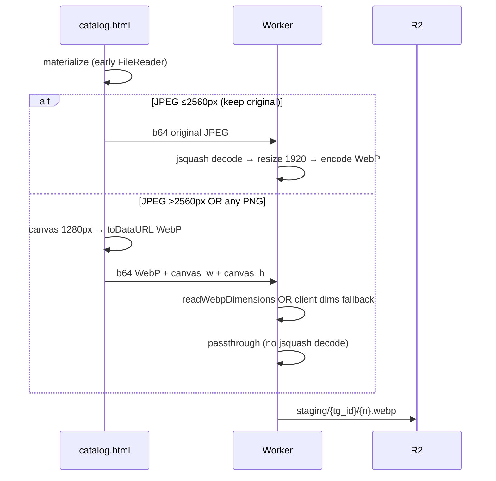

# Отладка загрузки фото портфолио (Telegram Mini App)

**Дата сбора:** 2026-05-29  
**Последнее обновление:** 2026-05-30 (сессия #3)  
**Статус:** **retest 5/5** — materialize ✅; transport ✅; passthrough ✅ (слоты 1–3 на v87/v88); слоты 4–5 падали на `compress skip small` → fix **v89**  
**Текущая версия клиента:** `v89canvaswebp` (деплой после commit в `main`)  
**Предыдущая:** `v88jpegoriginal` (commit `f37954b`)  
**Последний деплой Worker:** `6fa577cb-8c10-4d57-b21e-0ad07801ae9e` (commit `0389438`)

Документ для стороннего ИИ / разработчика: контекст, симптомы, архитектура, **полная история правок**, **логи пользователя**, **корневые причины**, гипотезы, что пробовать дальше.

---

## 0. Executive summary (для другого ИИ)

### Две разные корневые проблемы

| # | Проблема | Где | Fix |
|---|----------|-----|-----|
| **A** | Canvas output WebView **не декодируется `@jsquash`** | JPEG/PNG/WebP после `canvas.toDataURL` | Worker **WebP passthrough** (без decode) для canvas-path |
| **B** | **`readWebpDimensions` bug** — VP8 start code читался с offset 20 вместо 23 | `v86` passthrough возвращал `null` → fallback в jsquash → fail | Fix `v87webpfix` |
| **C** | **Original Telegram PNG** не декодируется `@jsquash/png` | slot 3, `1000041856.png` | Fix v88: PNG → canvas; superseded v89 |
| **D** | **`compress skip small`** → original Telegram **JPEG** → `@jsquash/jpeg` fail | slots 4–5, `1000041842.jpg` 204 KB | Fix **`v89canvaswebp`**: все файлы → canvas WebP |

### Что работает (подтверждено пользователем, тест #11 / `v87webpfix`)

- Слот 1: `1000041952.jpg` 4000×2252 → canvas WebP 174 KB → **upload OK** (нет `upload fail 1`)
- Слот 2: `1000041951.jpg` ~3 MB → canvas WebP 171 KB → **upload OK**

### Что сломалось на том же тесте

- Слот 3: `1000041856.png` 1.8 MB → `compress keep original 1536x1024` → `@jsquash/png` decode fail → `upload fail 3 portfolio_compress_failed`

### Актуальная стратегия upload (`v89canvaswebp`)

```
ВСЕ файлы (любой размер/формат) → canvas 1280px → WebP → Worker passthrough
jsquash на Worker не вызывается для upload payload
```

Удалены пути v86–v88: `compress skip small`, `compress keep original`.

---

## 1. Симптомы и ошибки по версиям

| Версия | Симптом / код | Причина |
|--------|---------------|---------|
| `v79` | «Не удалось связаться с сервером» | multipart / пустые слоты |
| `v80` | «Файл слишком большой» | compress timeout → original 4000×2252 |
| `v81`–`v82` | «Не удалось обработать фото» | `toBlob` hang / dim check bug |
| `v83`–`v84` | «Допустимы только JPEG…» | canvas JPEG/PNG undecodable (@jsquash) |
| `v85` | «Не удалось обработать фото» | canvas WebP undecodable (@jsquash) |
| `v86` | «Не удалось обработать фото» | passthrough fail (`readWebpDimensions` bug) |
| `v87` | слоты 1–2 OK, слот 3 fail | passthrough OK; original PNG fail |
| `v88` | слоты 1–2 OK, slot 3 PNG fix | PNG → canvas WebP |
| `v89` | **ожидает retest** | slots 4–5: убран `compress skip small` |

---

## 2. Окружение

| Параметр | Значение |
|----------|----------|
| Mini App | https://spaguet.github.io/networking_nhatrang/catalog.html |
| Debug URL (актуальный) | `https://spaguet.github.io/networking_nhatrang/catalog.html?portfolio_debug=1&v=12` |
| Production URL | `https://spaguet.github.io/networking_nhatrang/catalog.html?v=12` |
| API (Worker) | https://tg-networking-nhatrang.albertkoall.workers.dev |
| `WEBAPP_SECRET` | `getting_more_money` |
| Платформа | Telegram Mini App, **Android 13**, WebView `Mozilla/5.0 (Linux; Android 13; K) AppleWebKit/537.36 …` |
| Репозиторий | https://github.com/spaguet/networking_nhatrang (private) |
| ТЗ | `portfolio_TZ.md` v1.3 |

**Cache buster:** параметр `&v=N` в URL BotFather обязателен; смотреть первую строку `client vXXX`.

---

## 3. Тестовые файлы пользователя

Путь: `C:\Users\OMOW\Downloads\Telegram Desktop\`

| Telegram name | Размер | Разрешение (в WebView) | Upload strategy `v88` |
|---------------|--------|------------------------|------------------------|
| `1000041952.jpg` | 3.1 MB | 4000×2252 | canvas → WebP → passthrough |
| `1000041951.jpg` | 3.2 MB | ~4000×2252 | canvas → WebP → passthrough |
| `1000041856.png` | 1.8 MB | **1536×1024** (не 1122×1402!) | canvas → WebP → passthrough |
| `1000041842.jpg` | 204 KB | — | skip small / original JPEG |
| `1000041817.jpg` | 116 KB | 1240×1654 | skip small / original JPEG |
| `1000041919.jpg` | 76 KB | 899×1599 | skip small / original JPEG |

---

## 4. Архитектура (`v88jpegoriginal`)



### Отличия от ТЗ

- Transport: **JSON base64** (`upload_portfolio_staging_b64`), не multipart (H3).
- Sequential POST per photo (WebView workaround).
- Canvas: **`toDataURL`**, не `toBlob` (H2).
- Passthrough WebP: отступление от «server re-encode всего» (§6 ТЗ) — см. §19.

---

## 5. Ключевой код (актуальный)

### 5.1. Frontend — `catalog.html`

| Символ | Назначение |
|--------|------------|
| `PORTFOLIO_CLIENT_VERSION` | `'v89canvaswebp'` |
| `compressPortfolioFileForUpload` | всегда canvas 1280px → WebP |
| `canvasToUploadFile` | WebP→JPEG→PNG; `fetch(dataUrl)`; sets `canvasW/H` on File |
| `uploadPortfolioPhotoB64` | JSON + optional `canvas_w`, `canvas_h` |
| `bytesToBase64` | chunked `String.fromCharCode.apply` (32 KB chunks) |

```javascript
PORTFOLIO_CLIENT_VERSION = 'v89canvaswebp'
PORTFOLIO_UPLOAD_MAX_EDGE = 1280
PORTFOLIO_MAX_BYTES = 8 * 1024 * 1024
```

### 5.2. Backend — Worker

| Символ | Файл | Назначение |
|--------|------|------------|
| `upload_portfolio_staging_b64` | `portfolio.ts` | JSON handler |
| `base64ToBytes` | `portfolio.ts` | atob + for-loop + `& 0xff`; head/tail log |
| `parseCanvasDims` | `portfolio.ts` | `canvas_w`, `canvas_h` из body |
| `readWebpDimensions` | `media.ts` | VP8 / VP8L / VP8X parse (**fixed v87**) |
| `tryPassthroughClientWebp` | `media.ts` | passthrough + client dims fallback |
| `compressToWebp` | `media.ts` | passthrough first, else jsquash pipeline |

JSON body (расширение v87):

```javascript
{
  action: 'upload_portfolio_staging_b64',
  secret: '...',
  initData: '...',
  tg_id: 123,
  position: 1,
  name: 'photo.webp',
  data: '<base64>',
  canvas_w: 1280,   // optional, canvas-path only
  canvas_h: 721
}
```

---

## 6. Worker deploy history

| Version ID | Commit | Client | Изменение |
|------------|--------|--------|-----------|
| `4fb783ae` | `334414c` | v83 | b64 JSON handlers |
| `44e2f898` | `8666eca` | v84 | relaxed JPEG SOI |
| `92585a1b…` | `eabbc09` | v85 | b64 logging; decode fail code fix |
| `e7d9fb62…` | `95813af` | v86 | WebP passthrough (buggy VP8 parse) |
| `37edea58…` | `0389438` | v87 | **VP8 offset fix**; canvas_w/h |
| `6fa577cb…` | `0389438` | v87 | redeploy (same code) |

Client-only deploy:

| Commit | Client | Изменение |
|--------|--------|-----------|
| `f37954b` | v88 | `portfolioUploadKeepOriginal` — JPEG only |
| (next) | v89 | убраны `skip small` и `keep original` — только canvas WebP |

---

## 7. История коммитов (portfolio upload fix)

| Commit | Версия | Суть |
|--------|--------|------|
| `0b7c699` | v79earlyread | Early FileReader до DOM → materialize fix |
| `d494e73` | v80uploadcompress | compress timeout; не слать huge original |
| `f3bbb64` | v81dataurl | `toDataURL` вместо `toBlob` |
| `51432be` | v82dimcheck | risk check по output dims |
| `334414c` | v83b64upload | JSON base64 upload |
| `8666eca` | v84pngupload | canvas PNG export |
| `eabbc09` | v85webpupload | canvas WebP; fetch(dataUrl); b64 logging |
| `95813af` | v86webppass | original ≤2560; WebP passthrough |
| `0389438` | v87webpfix | fix VP8 header; canvas_w/h fallback |
| `f37954b` | v88jpegoriginal | original только JPEG; PNG → canvas |

---

## 8. Гипотезы

| ID | Гипотеза | Статус |
|----|----------|--------|
| H1 | `content://` URI умирает после yield | ✅ fix v79 |
| H1b | Кэш WebView | ✅ `&v=N` |
| H2 | `canvas.toBlob` never fires | ✅ fix toDataURL |
| H3 | Multipart портит bytes | ✅ fix b64 JSON |
| H4 | canvas-JPEG undecodable | ✅ подтверждена |
| H5 | compress timeout → too_large | ✅ fix v80 |
| H6 | dim check по original | ✅ fix v82 |
| H8 | **canvas output undecodable @jsquash (all formats)** | ✅ подтверждена |
| H9 | b64 atob truncation | ❌ маловероятна (174 KB WebP тоже fail до v87) |
| H10 | detectImageMime too strict | ❌ magic OK, fail на decode |
| **H11** | **`readWebpDimensions` VP8 start code wrong offset** | ✅ **v86 читал bytes[20-22], нужно [23-25]** |
| **H12** | **Original Telegram PNG undecodable @jsquash/png** | ✅ **тест #11 slot 3**; fix v88 |

---

## 9. Хронология сессий Cursor AI

### 9.1. Сессия #1 (30.05, день) — v79…v84

Materialize, compress, b64 transport, PNG export attempt. Детали в git log `0b7c699`…`8666eca`.

### 9.2. Сессия #2 (30.05, вечер) — v85…v86

**v85:** canvas WebP + safer b64; decode fail → `portfolio_compress_failed`.  
**Тест #9:** WebP 174 KB, magic OK, still fail → H8 confirmed.

**v86:** passthrough WebP + send original if ≤2560px.  
**Ожидание:** camera JPEG/PNG decode on server.

### 9.3. Сессия #3 (30.05, поздний вечер) — v87…v88

#### 9.3.1. Анализ Claude (после v86 fail / тест #9 still failing on v85)

Claude диагностировал:

```
upload b64 magic 82,73,70,70 len=174356  → MIME OK
upload fail portfolio_compress_failed     → passthrough null → jsquash fail
```

**Вывод Claude:** `tryPassthroughClientWebp` возвращает `null` потому что `readWebpDimensions` fail — **VP8 start code проверялся на bytes[20-22] вместо [23-25]** (frame tag 3 байта на 20-22, start code `9D 01 2A` на 23-25).

Claude также предложил fallback `canvas_w`/`canvas_h` от клиента — **реализовано**.

**Замечание:** Claude ошибочно предложил читать chunk FourCC с bytes[12-15] — это **chunk size**, не tag. Правильный FourCC: **bytes[16-19]**.

#### 9.3.2. `0389438` — `v87webpfix`

**Worker `media.ts`:**

- Переписан `readWebpDimensions`: RIFF/WEBP verify; VP8/VP8L/VP8X; VP8 keyframe check `(bytes[20]&1)===0`; start code at **23-25**.
- `tryPassthroughClientWebp(bytes, clientWidth?, clientHeight?)` — fallback dims + diagnostic logs.
- `compressToWebp(bytes, mime, opts?)` — прокидывает client dims.

**Worker `portfolio.ts`:**

- `parseCanvasDims(body)` — `canvas_w`, `canvas_h`.
- `processPhotoBytes(..., opts)` → `compressToWebp`.

**Client `catalog.html`:**

- `portfolioUploadFileFromBytes` — attaches `canvasW`, `canvasH` to File.
- `uploadPortfolioPhotoB64` — sends `canvas_w`, `canvas_h` in JSON.

**Deploy:** Worker `6fa577cb`; Pages `0389438`. BotFather `&v=10`.

**Примечание:** первый git push завис; повторён успешно.

#### 9.3.3. Тест #11 — `v87webpfix` — **частичный успех**

```
client v87webpfix Mozilla/5.0 (Linux; Android 13; K) Apple
read ok ×5, materialize ×5, preview ×5
compress ok webp 1000041952.jpg 3137669→174356 1280x721
upload slot 1 174356 1000041952.webp
upload b64 magic 82,73,70,70 len=174356
compress ok webp 1000041951.jpg 3178695→171506 1280x721
upload slot 2 171506 1000041951.webp
upload b64 magic 82,73,70,70 len=171506
compress keep original 1536x1024 1000041856.png 1841473
upload slot 3 1841473 1000041856.png
upload b64 magic 137,80,78,71 len=1841473
upload fail 3 portfolio_compress_failed
```

**Анализ:**

| Слот | Путь | Результат |
|------|------|-----------|
| 1 | canvas WebP | ✅ **OK** (нет upload fail) — passthrough работает |
| 2 | canvas WebP | ✅ **OK** |
| 3 | original PNG 1.8 MB | ❌ jsquash PNG decode fail |

**Вывод:** v87 fix **подтверждён** для canvas WebP. Новая проблема: **original PNG из Telegram** (не canvas!) не проходит `@jsquash/png`.

#### 9.3.4. `f37954b` — `v88jpegoriginal`

**Проблема v86/v87:** `compress keep original` применялся ко **всем** форматам с long edge ≤2560. PNG попадал на jsquash decode → fail.

**Fix:**

```javascript
function portfolioUploadKeepOriginal(file) {
  // true ONLY for JPEG (type or .jpg extension)
}

// in compressPortfolioFileForUpload img.onload:
if (portfolioUploadKeepOriginal(file) && longEdge <= 2560 && !rejectRisk) {
  succeed(file, 'compress keep original ...');
}
```

PNG `1000041856.png` теперь: canvas 1280px → WebP → passthrough (как большие JPEG).

**Deploy:** Pages only (`f37954b`). Worker без изменений. BotFather `&v=11`.

**Ожидаемый лог slot 3:**

```
compress ok webp 1000041856.png 1841473→~120000 1280x853
upload slot 3 ...webp
(нет upload fail)
```

---

## 10. Все логи пользователя (краткий индекс)

| # | Версия | Результат |
|---|--------|-----------|
| 1 | d2eaa84 | materialize intermittent fail |
| 2 | 78a8a57 | кэш / no early read |
| 3 | v79 | materialize ✅; upload too_large |
| 4 | v80 | toBlob timeout |
| 5 | v81 | compress ok but dim check fail |
| 6 | v82 | upload invalid_type (multipart/b64) |
| 7 | v83 | b64 JPEG magic OK, invalid_type |
| 8 | v84 | PNG 2.2 MB, invalid_type |
| 9 | v85 | WebP 174 KB, compress_failed |
| 10 | v86 | (не зафиксирован отдельным логом; passthrough buggy) |
| 11 | v87 | **слоты 1–2 OK**, slot 3 PNG fail |
| 12 | v88 | **ожидается** |

---

## 11. Debug checklist

1. URL: `?portfolio_debug=1&v=12`
2. Первая строка: `client v89canvaswebp …`
3. Worker tail:

```bash
cd worker && npx wrangler tail
```

Ожидаемые строки для canvas WebP:

```
[media] webp passthrough attempt 174356
[media] readWebpDimensions result { width: 1280, height: 721 }
[media] webp passthrough 174356 1280 x 721
```

4. Live check:

```bash
curl.exe -s "https://spaguet.github.io/networking_nhatrang/catalog.html" | findstr "v89canvaswebp"
```

---

## 12. Ожидаемый успешный лог (`v89canvaswebp`)

```
client v89canvaswebp …
read ok ×5
materialize ×5
preview ×5
compress ok webp 1000041952.jpg … 1280x721
upload slot 1 … (no fail)
compress ok webp 1000041951.jpg …
upload slot 2 … (no fail)
compress ok webp 1000041856.png … 1280x853
upload slot 3 … (no fail)
compress ok webp 1000041842.jpg 204630→… 1280x…
upload slot 4 … (no fail)
compress ok webp 1000041817.jpg … 1280x…
upload slot 5 … (no fail)
→ QR в чат
```

---

## 13. Чеклист для следующего ИИ

### Закрыто

- [x] Materialize (H1)
- [x] Transport b64 JSON (H3)
- [x] Canvas compress toDataURL (H2)
- [x] Canvas output undecodable — passthrough path (H8)
- [x] VP8 header parse bug (H11) — v87
- [x] Original PNG path — route to canvas (H12) — v88
- [x] Small JPEG `skip small` → jsquash fail (H13) — v89

### Если v89 всё ещё fail

1. **Regression slots 1–3:** passthrough / `readWebpDimensions` / `canvas_w/h`.
2. **Slots 4–5:** должны быть `compress ok webp`, не `compress skip small`.
3. **Nuclear option:** client-side WASM encode; Bot API `file_id` upload.

### Критерий успеха

- [ ] 5/5 upload slots без `upload fail`
- [ ] `select_payment_method` → QR
- [ ] R2: `portfolio/staging/{tg_id}/1.webp` … `5.webp`

---

## 14. Маппинг ошибок UI

| JSON `error` | UI | Когда |
|--------------|-----|-------|
| `portfolio_compress_failed` | Не удалось обработать фото | jsquash decode fail **или** passthrough null (v86) |
| `portfolio_invalid_type` | Допустимы только JPEG… | bad magic (редко) |
| `portfolio_too_large` | Файл слишком большой | dims/bytes limits |
| `portfolio_upload_failed` | generic | b64 null / auth |

---

## 15. API

```javascript
var API_URL = 'https://tg-networking-nhatrang.albertkoall.workers.dev';
var WEBAPP_SECRET = 'getting_more_money';
```

---

## 16. Связанные документы

| Файл | Содержание |
|------|------------|
| `portfolio_TZ.md` | ТЗ v1.3 |
| `migration_to_cf_d1_TZ.md` | API contract |
| `tests/portfolio-preview-run.mjs` | Playwright preview only |

---

## 17. Deep dive: VP8 header layout (bug H11)

WebP file structure:

```
0-3:   'RIFF'
4-7:   file size - 8
8-11:  'WEBP'
12-15: chunk size (LE)        ← НЕ FourCC!
16-19: chunk FourCC ('VP8 ', 'VP8X', 'VP8L')
20+:   chunk payload
```

**VP8 lossy (`VP8 `) payload:**

```
20-22: frame tag (3 bytes); bit0=0 → key frame
23-25: start code 0x9D 0x01 0x2A    ← v86 ошибочно проверял здесь bytes[20-22]
26-27: width (14 bit LE)
28-29: height (14 bit LE)
```

**v86 buggy code:**

```typescript
if (bytes[20] !== 0x9d || bytes[21] !== 0x01 || bytes[22] !== 0x2a) return null;
```

**v87 fixed code:**

```typescript
if ((bytes[20] & 0x01) !== 0) return null;
if (bytes[23] !== 0x9d || bytes[24] !== 0x01 || bytes[25] !== 0x2a) return null;
```

---

## 18. Deep dive: почему original PNG fail (H12)

`1000041856.png`:

- 1841473 bytes (~1.8 MB)
- WebView reports 1536×1024
- Magic `137,80,78,71` valid on client
- v86/v87: sent as **original** (≤2560px rule for all formats)
- Worker: `compressToWebp` → `decodePng` → **null** → `portfolio_compress_failed`

**Camera/original JPEG** декодируется (wrangler tail: `processPhoto 1 3137669`).  
**Telegram PNG** — нет (возможны: нестандартный PNG, interlace, color type, или b64 corruption tail — но magic OK).

**Практичный fix:** не отправлять PNG original; canvas → WebP → passthrough (v88).

---

## 19. Deep dive: passthrough vs ТЗ

ТЗ §6: server-side WebP encode с quality loop для всех входов.

Passthrough:

- Применяется только к **canvas-WebP** ≤600 KB, long edge ≤1920
- Validation: RIFF magic + header dims (+ optional client dims)
- **Не** применяется к original JPEG (там полный jsquash pipeline)
- Security: size cap + magic + dims; no arbitrary file types

---

## 20. Рекомендации внешних ИИ — итог

| Источник | Рекомендация | Статус |
|----------|--------------|--------|
| ИИ #1 (b64/atob) | WebP client; tail logging; fix b64 | ✅ v85 |
| ИИ #1 | PNG truncation on 2.2 MB | ❌ не главная причина |
| Claude (VP8 parse) | Fix offset 23-25; canvas_w/h | ✅ v87; **подтверждено тестом #11** |
| Claude | chunk tag at 12-15 | ❌ **ошибка** — FourCC at 16-19 |
| Cursor (v88) | original only JPEG | ✅ deployed |

---

## 21. Краткий вывод для ИИ

1. **Три слоя багов:** transport (fixed v83) → canvas/jsquash (fixed passthrough v86+) → VP8 parse (fixed v87) → PNG original (fixed v88).
2. **Тест #11 доказал:** passthrough работает для canvas WebP после v87.
3. **Следующий retest:** `v89canvaswebp`, URL `&v=12`, ожидать 5/5 upload.
4. **Worker tail** — главный инструмент диагностики passthrough.
5. **Playwright** не покрывает paid upload — только preview.

---

*Документ обновлён 2026-05-30: сессии Cursor #1–#3, тесты #1–#11, fix v79–v88, анализ двух внешних ИИ (b64 + Claude VP8).*
