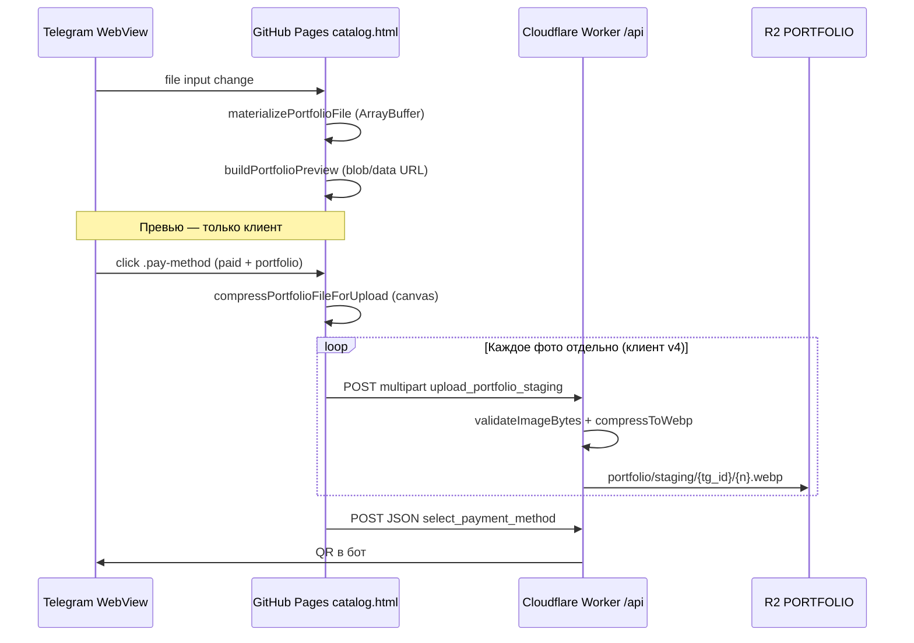

# Отладка загрузки фото портфолио (Telegram Mini App)

**Дата сбора:** 2026-05-29  
**Статус:** баг **не закрыт** — воспроизводится у пользователя в Telegram Android на платном сценарии  
**Последний коммит с правками клиента:** `e0b745d` (`main`)

Документ для стороннего ИИ / разработчика: контекст, симптомы, архитектура, история фиксов, гипотезы, чеклист отладки.

---

## 1. Симптомы (от пользователя)

### 1.1. Превью на форме

- При добавлении фото **не у всех** тестовых файлов появляется превью в слоте `#portfolioSlots`.
- Слот может остаться серым (класс `is-loading`) или без картинки.
- Проблема **интерmittent**: одно и то же изображение иногда загружается в превью, при повторном добавлении — нет.
- До отправки на сервер пользователь **не доходит** (ошибка на этапе оплаты).

### 1.2. Платное размещение (основной сценарий сбоя)

1. Заполнить форму, включить «Добавить портфолио», добавить фото.
2. «Разместить платно» → экран выбора способа оплаты.
3. Нажать способ оплаты (`.pay-method`).
4. Появляется **«Подготовка фото…»**.
5. Затем ошибка: **«Не удалось связаться с сервером. При загрузке фото попробуйте 1–2 снимка или перезапустите Mini App.»**

Интернет у пользователя работает; JSON-запросы приложения (каталог, профиль) в целом живые.

### 1.3. Ранее наблюдавшиеся ошибки (история)

| Этап | Сообщение | Причина (установленная) |
|------|-----------|-------------------------|
| Выбор файла | «Допустимы только JPEG, PNG или WebP» | Строгая проверка `file.type` в WebView Telegram (пустой MIME, `application/octet-stream`, `image/pjpeg`) |
| Upload | «Проверьте интернет и попробуйте снова» | Generic `apiErrorMessage` при `fetch` throw (`Failed to fetch`) — не реальный обрыв интернета |

---

## 2. Окружение

| Параметр | Значение |
|----------|----------|
| Mini App (frontend) | https://spaguet.github.io/networking_nhatrang/catalog.html |
| API (Worker) | https://tg-networking-nhatrang.albertkoall.workers.dev |
| `WEBAPP_SECRET` в catalog.html | `getting_more_money` (синхрон с wrangler secret) |
| Платформа воспроизведения | **Telegram Mini App, Android** (WebView) |
| Desktop Chrome / Playwright | тесты **проходят** — баг специфичен для Telegram WebView |
| OS пользователя (dev machine) | Windows 10 |
| ТЗ | `portfolio_TZ.md` v1.3 |

---

## 3. Тестовые файлы пользователя

Путь на машине тестировщика: `C:\Users\OMOW\Downloads\Telegram Desktop\`

| Файл | Размер | Формат | Разрешение | Magic bytes | Поведение (со слов пользователя) |
|------|--------|--------|------------|-------------|----------------------------------|
| `IMG-20260529-WA0000.jpg` | 76 KB | JPEG (JFIF) | 899×1599 | `FF D8 FF E0…` | Обычно **работает** (WhatsApp-сжатое) |
| `20260529_163459.jpg` | 3.0 MB | JPEG (EXIF) | 4000×2252 | `FF D8 FF E1…` | Часто **не работает** (камера) |
| `file_00000000fda071faa9077be2dcf37557.png` | 2.6 MB | PNG | 1122×1402 | `89 50 4E 47…` | **Не работает** (интерmittent превью) |
| `IMG_20260525_090547_878.jpg` | 116 KB | JPEG (EXIF) | 1240×1654 | `FF D8 FF E1…` | **Не работает** (интерmittent) |

Все файлы валидные, лимит клиента 8 MB не превышен.

---

## 4. Архитектура потока данных



### 4.1. Бесплатный submit

`submit_listing` (JSON) → `upload_portfolio` (multipart) → notify админу.

### 4.2. Платный submit (§7.3 portfolio_TZ.md)

- **Staging НЕ на `#paidBtn`** — только на клик `.pay-method`.
- Цепочка: `validateFormClient` → `validatePortfolioClient` → `uploadPortfolioStaging` → `select_payment_method` → `tg.close()`.
- Код: `catalog.html` ~3687–3759.

---

## 5. Ключевые файлы и функции

### 5.1. Frontend — `catalog.html`

| Функция | Назначение | Строки (~) |
|---------|------------|------------|
| `portfolioFileMimeOk` | MIME + fallback для Telegram | 3110–3128 |
| `materializePortfolioFile` | `readAsArrayBuffer` → in-memory `File` | 3219–3242 |
| `addPortfolioFile` | слот + pending + materialize + preview | 3131–3189 |
| `buildPortfolioPreview` | blob URL / canvas thumb 384px | 3033–3070 |
| `compressPortfolioFileForUpload` | canvas → JPEG max 1920px перед upload | 3245–3292 |
| `uploadPortfolioPhotosSequential` | **по одному фото** на запрос | 3306–3337 |
| `uploadPortfolioStaging` | action `upload_portfolio_staging` | 3349–3350 |
| `apiPostMultipart` | fetch + timeout 120s | 2059–2084 |
| `apiErrorMessage` | маппинг ошибок fetch | 2087–2117 |
| `bindPortfolioFileInput` | пересоздание `<input>` после каждого выбора | 3525–3534 |

Константы: `PORTFOLIO_MAX_FILES = 5`, `PORTFOLIO_MAX_BYTES = 8 MiB`.

HTML input:

```html
<input type="file" id="portfolioFileInput"
  accept="image/jpeg,image/jpg,image/png,image/webp,image/*" hidden />
```

Meta no-cache в `<head>` (кэш Mini App).

### 5.2. Backend — Cloudflare Worker

| Файл | Назначение |
|------|------------|
| `worker/src/index.ts` | `POST /api` → multipart или JSON |
| `worker/src/handlers/portfolio.ts` | `handleUploadPortfolioStaging`, `handleUploadPortfolio` |
| `worker/src/services/media.ts` | magic bytes, resize 1920, WebP, лимиты §6 |
| `worker/src/utils/portfolio-auth.ts` | rate limit KV `portfolio_rl:{tg_id}` 30/час |
| `worker/src/utils/response.ts` | CORS `Access-Control-Allow-Origin: *` |

Лимиты сервера (`media.ts`):

- Вход: max **8 MB**, JPEG/PNG/WebP по magic bytes
- Выход: WebP, long edge **1920**, target ≤400 KB, hard cap **600 KB**

Multipart contract (`upload_portfolio_staging`):

```
action=upload_portfolio_staging
initData=<Telegram WebApp initData>
secret=<WEBAPP_SECRET>
tg_id=<user id>
photo_1 … photo_5  (File, multipart)
```

---

## 6. Маппинг ошибок UI

### 6.1. `apiErrorMessage(err)` — когда `fetch` упал (`.catch`)

| Условие | Текст пользователю |
|---------|-------------------|
| `err.name === 'AbortError'` | Превышено время ожидания… |
| `Failed to fetch` / `TypeError` | **«Не удалось связаться с сервером. При загрузке фото…»** ← текущий баг |
| `http_error` | Ошибка сервера (HTTP N) |
| JSON `{ ok: false, error: "…" }` | `portfolioErrorMessage` / `ERRORS[…]` — **не** через `apiErrorMessage` |

**Важно:** сообщение «не удалось связаться с сервером» означает, что **ответ Worker не получен** (обрыв, CORS без тела, таймаут WebView, краш Worker до ответа). Это **не** `portfolio_upload_failed` от сервера.

### 6.2. Где показывается ошибка при оплате

```javascript
uploadPortfolioStaging(paymentStatusEl)
  .catch(function (err) {
    showStatus(paymentStatusEl, apiErrorMessage(err), 'err');
  });
```

Если сервер вернул JSON с `ok: false`, сработает `.then` → `portfolioErrorMessage(stagingData)`.

---

## 7. Расхождение клиента с ТЗ

`portfolio_TZ.md` §7.2 / §312–315: **atomic upload** — один multipart с `photo_1…photo_n`, all-or-nothing.

**Текущая реализация (с `e0b745d`):** `uploadPortfolioPhotosSequential` — **отдельный POST на каждое фото**. Сделано как workaround для Telegram WebView (малые запросы).

Следствия для отладки:

- Worker обрабатывает каждый запрос независимо; partial staging возможен при падении на N-м фото.
- Rate limit: **30 upload/час/tg_id** — при многократных тестах может сработать (вернёт JSON, не fetch throw).

---

## 8. История коммитов (попытки исправления)

| Commit | Что менялось |
|--------|--------------|
| `e4a4408` | `portfolioFileMimeOk`: fallback по расширению при пустом MIME |
| `00956d1` | Принятие `image/*`, `pjpeg`, `x-png` |
| `d5a2baa` | Инкрементальный DOM слотов; canvas preview >512KB; тест Playwright |
| `01c5b0b` | FileReader data URL; no-cache meta; clone file input после выбора |
| `9537918` | Client-side compress перед upload; таймаут fetch; улучшен `apiErrorMessage` |
| `e0b745d` | **materializePortfolioFile** (ArrayBuffer); **sequential upload**; validate pending |

GitHub Pages: функции `buildPortfolioPreview`, `materializePortfolioFile`, `uploadPortfolioPhotosSequential` **деployed** (проверено fetch live HTML).

---

## 9. Автотесты (desktop — проходят)

### 9.1. Playwright

```bash
cd d:\cursor_dev\networking
npm install playwright   # если нет
node tests/portfolio-preview-run.mjs
```

Файл: `tests/portfolio-preview-run.mjs`  
Результат на Chromium (2026-05-29): все 4 тестовых файла — превью OK, дубликаты OK.

**Ограничение:** не эмулирует Telegram WebView / `content://` URI / реальный `initData`.

### 9.2. curl multipart на Worker

```bash
curl -X POST "https://tg-networking-nhatrang.albertkoall.workers.dev/api" \
  -F "action=upload_portfolio_staging" \
  -F "initData=invalid" \
  -F "secret=getting_more_money" \
  -F "photo_1=@20260529_163459.jpg"
```

Ответ: `{"ok":false,"error":"Invalid_initData"}` HTTP 200 за ~2s — **сеть и multipart до Worker доходят**.

### 9.3. Локальный pipeline Worker (@jsquash)

Запуск `tsx` + `media.ts` на JPG в Node **завис/упал** (WASM в Node без Cloudflare runtime). **Не использовать** как доказательство битых файлов.

---

## 10. Гипотезы (не подтверждены / частично)

### H1. Telegram WebView не читает `content://` файлы через FileReader

- `materializePortfolioFile` всё ещё использует `readAsArrayBuffer(file)` на объекте из picker.
- Если read fails → слот удаляется с `portfolio_upload_failed` (превью нет).
- Если read «успешен», но буфер битый → превью пустое, upload падает на fetch.

**Проверка:** логировать `buf.byteLength` vs `file.size` в WebView (Telegram logging / eruda).

### H2. `canvas.toBlob` / `createObjectURL` нестабильны в WebView

- `compressPortfolioFileForUpload` и `buildPortfolioPreview` зависят от canvas.
- На части устройств canvas memory limit ниже.

**Проверка:** пропустить compress на клиенте, отправить materialized File as-is одним маленьким файлом.

### H3. Multipart + `initData` + большой body обрывается WebView

- Даже sequential upload ~300–800 KB JPEG может рваться.
- `Failed to fetch` без HTTP status.

**Проверка:** Worker logs / Cloudflare Observability на `upload_portfolio_staging`; временный endpoint echo размера body.

### H4. Worker CPU / memory timeout на decode 4000×2252

- `@jsquash` decode ~36 MB RGBA на кадр.
- Может убить isolate **после** получения запроса → клиент видит обрыв (не JSON).

**Проверка:** логи Worker, `wrangler tail`; тест с уже сжатым клиентом 1920px.

### H5. CORS на error response от Cloudflare

- При 502/1101 без CORS headers браузер показывает `Failed to fetch`.

**Проверка:** DevTools Network в Telegram Desktop (если доступен) или proxy.

### H6. Превью: race / `pending` слоты

- `getPortfolioFiles()` фильтрует `!pending`.
- Если materialize медленный, пользователь успевает нажать оплату → «Подождите, фото ещё обрабатывается» (другой текст).
- Пользователь видит другую ошибку → materialize завершился, но preview URL не отрисовался (`img` onerror не обрабатывается).

### H7. `releasePortfolioPreviewUrl` vs data URL

- `releasePortfolioPreviewUrl` revokes только `blob:`; data URL не revoke — OK.
- При compress upload создаётся новый blob URL для Image — если совпадает timing с preview revoke — маловероятно.

---

## 11. Чеклист для стороннего ИИ

### 11.1. Воспроизведение

- [ ] Telegram Android, Mini App из бота, **paid flow** + portfolio ON
- [ ] Тестовые файлы из §3 (минимум `20260529_163459.jpg` + PNG)
- [ ] 1 фото vs 3–5 фото
- [ ] Полностью закрыть Mini App между попытками (кэш)

### 11.2. Инструментирование (рекомендуется добавить временно)

```javascript
// В materializePortfolioFile reader.onload:
console.log('[portfolio] materialize', file.name, file.size, buf.byteLength);

// В uploadPortfolioPhotosSequential перед fetch:
console.log('[portfolio] upload', slot.position, compressed.size || compressed.byteLength);

// В apiPostMultipart catch:
console.log('[portfolio] fetch fail', err.name, err.message);
```

Telegram: `Telegram.WebApp.showAlert(JSON.stringify(...))` если console недоступен.

### 11.3. Server-side

```bash
cd worker && npx wrangler tail
```

Смотреть: доходит ли `upload_portfolio_staging`, `handleUploadPortfolioStaging`, ошибки D1/R2/KV.

### 11.4. Быстрые эксперименты

1. **Отключить client compress** — отправить materialized file напрямую.
2. **Один файл 76 KB WhatsApp** — проходит ли paid flow целиком?
3. **Base64 JSON upload** (новый action) — обход multipart WebView (большая доработка).
4. **Telegram Bot API sendPhoto** вместо fetch multipart (альтернативная архитектура).
5. Вернуть **single multipart** vs sequential — сравнить поведение.

### 11.5. Валидация успеха

- Превью: `#portfolioSlots img` с `naturalWidth > 0`
- Staging: R2 ключи `portfolio/staging/{tg_id}/1.webp` …
- UI: переход к «QR отправлен в чат», `tg.close()`

---

## 12. Связанные документы

| Файл | Содержание |
|------|------------|
| `portfolio_TZ.md` | Полное ТЗ v1.3, §6 лимиты, §7 форма, §7.3 paid |
| `migration_to_cf_d1_TZ.md` | API contract, multipart actions |
| `DEPLOY_GUIDE_CF.md` | Deploy Worker, R2, smoke tests |
| `tests/portfolio-preview-run.mjs` | Playwright тест превью |
| `tests/portfolio-preview-test.html` | Standalone harness |

---

## 13. Контактные точки API (для mock-тестов)

```javascript
var API_URL = 'https://tg-networking-nhatrang.albertkoall.workers.dev';
var WEBAPP_SECRET = 'getting_more_money';
```

JSON health:

```bash
curl -X POST "$API_URL/api" -H "Content-Type: application/json" \
  -d '{"action":"get_listings","category":"services","secret":"getting_more_money"}'
```

---

## 14. Краткий вывод для ИИ

1. Баг **воспроизводится в Telegram Android**, не в desktop Chrome.
2. Платный путь падает на **`upload_portfolio_staging`** (fetch throw), не на «нет интернета».
3. Превью и upload используют **разные цепочки**, но оба завязаны на чтение File в WebView.
4. Уже пробованы: MIME fixes, blob/data URL preview, materialize ArrayBuffer, sequential upload, client compress — **недостаточно**.
5. Следующий фокус: **доказать**, доходит ли HTTP запрос до Worker; если да — CPU/memory jsquash; если нет — WebView multipart / размер / initData.

---

## 15. Правки 2026-05-29 (после рекомендации стороннего ИИ)

### Клиент (`catalog.html`)

- `compressPortfolioFileForUpload`: файлы **< 300 KB** — без canvas; **таймаут 5 s** + **toBlob timeout 3 s**; fallback на оригинал; max edge **1280** (было 1920); quality **0.75**.
- `buildPortfolioPreview`: таймаут 5 s на canvas-путь (серые слоты).
- Debug: `?portfolio_debug=1` → `#portfolioDebugLog` + `portfolioTwlog()` (materialize / compress / upload).

### Worker (`media.ts`, `portfolio.ts`)

- Чтение JPEG/PNG dimensions **до** `@jsquash` decode; отказ при long edge **> 2560** или **> 2 MB** без читаемых dimensions.
- `console.log` в `processPhotoFile` и при reject — для `wrangler tail`.

### Деплой

1. Worker: `cd worker && npx wrangler deploy`
2. GitHub Pages: push `catalog.html`
3. Тест в Telegram: `catalog.html?portfolio_debug=1` + `wrangler tail`

---

*Документ сгенерирован по результатам сессии отладки 2026-05-29. Обновлять при новых коммитах или симптомах.*
